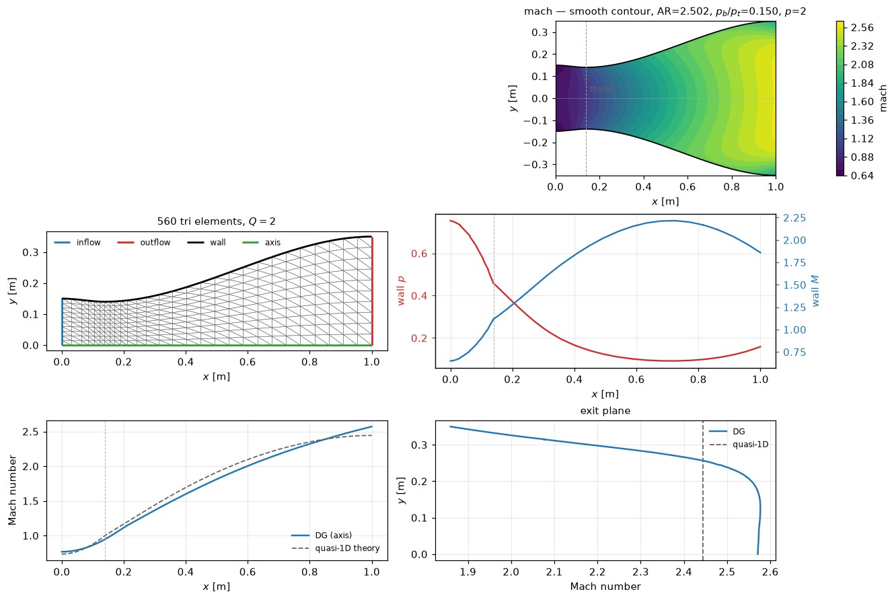
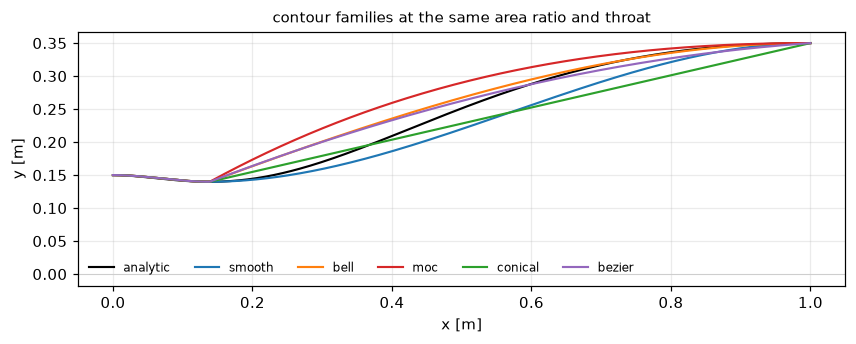
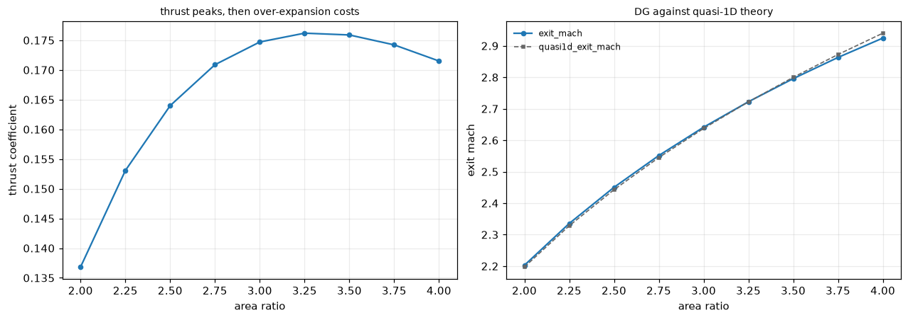
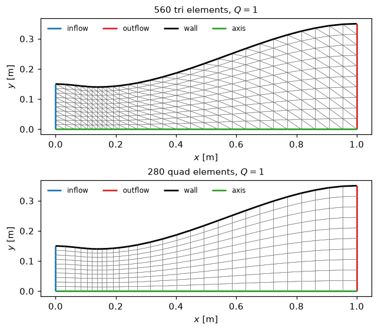
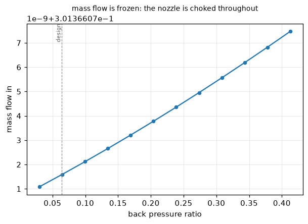

# 2D Discontinuous Galerkin nozzle code

A 2D discontinuous Galerkin solver for the compressible Euler equations, built
for **nozzle design studies**.

You change the geometry, sweep it, and take sensitivities. You do not write the
solver — it is already written, verified, and fast.



```python
from dgnozzle import solve_nozzle, performance

result = solve_nozzle(area_ratio=3.0, back_pressure_ratio=0.12, order=1)
print(performance(result).summary())
```

---

## Contents

- [Quick start](#quick-start)
- [The launcher](#the-launcher)
  - [The cases](#the-cases)
  - [Case files you pass as an argument](#case-files-you-pass-as-an-argument)
- [Install](#install)
- [Run it from Python](#run-it-from-python)
- [Documentation](#documentation)
- [Design variables](#design-variables)
- [What students do with it](#what-students-do-with-it)
  - [1. Parameter sweeps](#1-parameter-sweeps)
  - [2. Sensitivity analysis](#2-sensitivity-analysis)
  - [3. Shape optimisation](#3-shape-optimisation)
- [Choosing resolution](#choosing-resolution)
- [Backends and performance](#backends-and-performance)
  - [Where the time goes](#where-the-time-goes)
  - [What made it faster](#what-made-it-faster)
  - [The time step](#the-time-step)
- [Choking, as a check on the solver](#choking-as-a-check-on-the-solver)
- [Known limitation: shocked operating points](#known-limitation-shocked-operating-points)
- [Verification](#verification)
- [Troubleshooting](#troubleshooting)

---

## Quick start

You need Python 3.10+ and nothing else. Clone it and run:

```bash
git clone https://github.com/mrodrig6/dg.git
cd dg
./dg2d.sh check
```

```
python   3.12.3  (/usr/bin/python3)
dgnozzle 1.0.0  (/home/you/dg/dgnozzle)
backends numba, numpy, jax
  yes  numba        the fast solver
  yes  jax          gradients and sensitivity
  yes  matplotlib   figures
  yes  scipy        optimisation
```

**There is no install step and nothing to compile.** The package sits at the
repository root, so `python -m dgnozzle ...` works as soon as you are standing in
the clone. `dg2d.sh` adds that it works from *any* directory, puts the repository
on the import path when the package is not installed, and gives you shorter
arguments. It uses whatever environment you have loaded — set
`DG2D_PYTHON=python3.12` to pin a different one.

If `check` reports a `NO`, that optional piece is missing. Add them all with:

```bash
./dg2d.sh install
```

Then solve something:

```bash
./dg2d.sh solve area_ratio=3.0 back_pressure_ratio=0.12 order=1
```

It prints the convergence history, then:

```
thrust        0.054007  (c_F = 0.193026, 92.24% of ideal)
  wall form   0.053504  (imbalance 9.31e-03)
mass flow     in 0.301234, out 0.301633  (imbalance 1.32e-03)
exit          M = 2.7188, p/p_t = 0.05041
entropy error 1.8657e-02
```

Thrust appears twice because it is computed from two mathematically identical
integrals; the `imbalance` between them is a free estimate of discretisation
error, and it falls when you raise `refine`.

And run the three studies the course is built around:

```bash
./dg2d.sh run sweep          # parameter sweep, finds the thrust optimum
./dg2d.sh run sensitivity    # adjoint gradients vs finite differences
./dg2d.sh run optimise       # L-BFGS-B on a Bézier wall
```

---

## The launcher

`./dg2d.sh help` lists everything. Arguments are `name=value`, using the same
names as the Python API, so there is one vocabulary to learn rather than two.

| Command | What it does |
|---|---|
| `./dg2d.sh check` | report the Python, the version, and which backends work |
| `./dg2d.sh list` | list the cases `run` can execute and the decks `@` expands |
| `./dg2d.sh run <case>` | run one of the scripts in [`examples/`](examples/) |
| `./dg2d.sh solve ...` | one operating point |
| `./dg2d.sh sweep <var> <lo> <hi> <n> ...` | sweep one design variable |
| `./dg2d.sh geometry ...` | inspect a contour; no flow solve |
| `./dg2d.sh bench ...` | time the backends against each other |
| `./dg2d.sh test` | run the test suite |
| `./dg2d.sh install` | `pip install -e ".[all]"`, if you want it installed |
| `./dg2d.sh docs` | where the documentation is |

```bash
./dg2d.sh solve ar=3.0 pb=0.12 p=1 figure=result.png
./dg2d.sh sweep area_ratio 2.0 4.0 9 order=1 csv=sweep.csv
./dg2d.sh geometry contour=bezier bezier_w1=0.7 figure=wall.png
./dg2d.sh bench p=1 refine=1
```

Short aliases: `p`=`order`, `Q`=`geometry_order`, `ref`=`refine`,
`ar`=`area_ratio`, `pb`=`back_pressure_ratio`, `tvb`=`tvb_constant`. Ordinary
`--flags` pass through untouched, so anything `python -m dgnozzle --help`
documents still works. `M` is deliberately **not** an alias — in this code `M`
always means Mach number, and the TVB constant is not a Mach number.

`geometry` runs no flow solve — use it to check a contour before committing to
a simulation.

**Interface flux.** Two are available, and the choice is a real one:

| `flux=` | What it is | Use it when |
|---|---|---|
| `roe` (default) | Roe's approximate Riemann solver with the Harten–Hyman entropy fix | **Accuracy.** Consistently the lowest entropy error, and what every number in this README was produced with |
| `hllc` | HLLC with Batten's wave speeds | **Robustness.** Provably positivity-preserving, needs no entropy fix and so has no constant to tune, and is cheaper |

Measured at the design point: HLLC converges in 451 iterations against Roe's 751
at `p=0` and agrees to ~1% in thrust, while Roe is the more accurate of the two
(entropy error 3.8e-3 against 6.2e-3 at `p=1`). Neither fixes the `p>=1` shocked
divergence. See [`docs/theory.md`](docs/theory.md#hllc-and-why-it-is-the-robust-choice).

Both run on the Numba fast path.

### The cases

| `run` | Script | Shows | Needs | Roughly |
|---|---|---|---|---|
| `solve` | `01_solve.py` | one design point against quasi-1D theory | — | 5 s |
| **`sweep`** | `02_sweep.py` | **sweeping the area ratio; the thrust optimum** | — | 1 min |
| **`sensitivity`** | `03_sensitivity.py` | **adjoint gradients, verified against finite differences** | JAX | 2 min |
| **`optimise`** | `04_optimise.py` | **L-BFGS-B on a Bézier wall** | JAX, SciPy | 5 min |
| `convergence` | `05_convergence.py` | observed order of accuracy | — | 5 min |
| `shock` | `06_shock.py` | all four operating regimes | — | 5 min |

They are meant to be copied and edited: changing the geometry in one of them is
the normal way to start a study.

### Case files you pass as an argument

A case you run often does not have to live in your shell history. A `@name`
argument is replaced by the lines of [`cases/name.dg`](cases/), so:

```bash
./dg2d.sh solve @design              # exactly the lines in cases/design.dg
./dg2d.sh solve @design pb=0.12      # the same deck, with one value changed
./dg2d.sh sweep back_pressure_ratio 0.05 0.3 12 @design
./dg2d.sh bench @converged
```

A deck is the same `name=value` lines you would have typed — there is no second
vocabulary and no schema to keep in step with the code:

```
# the design point: shock-free, fully expanded, the case to start from
ar=2.5
pb=0.064
p=1
Q=2
ref=0
```

`#` starts a comment, blank lines are ignored, and **a deck may name another
deck** to build on it, which is all `cases/overexpanded.dg` is:

```
# over-expanded: the exit plane sits below ambient, still shock-free
@design
pb=0.15
```

**Later arguments win.** That is what makes `@design pb=0.12` an override rather
than a conflict, and it is a property of the underlying parser rather than
something the launcher arranges, so it holds for every key.

| Deck | What it is |
|---|---|
| `@design` | the design point: shock-free, fully expanded |
| `@overexpanded` | exit plane below ambient, still shock-free |
| `@converged` | the design point at `p=2`, `refine=1` — quote numbers from this |
| `@shocked` | a shock in the diverging section, at `p=0` because `p>=1` diverges |
| `@contour` | geometry only, for `geometry` |

Because this is argument expansion and nothing more, a deck works with any
subcommand that accepts the keys it holds: `solve`, `sweep` and `bench` take the
full set, while `geometry` takes only the geometry keys and will say
`unrecognized arguments` if handed a deck carrying solver options — which is
also what a typo gets, rather than being silently ignored.

Decks cover one operating point on one mesh. For a sweep with a loop in it, a
sensitivity study or an optimisation, write a Python case file instead — that is
what [`examples/`](examples/) is, and the names are the same either way, so
nothing has to be unlearned when you outgrow a deck.

---

## Install

Only needed if you want `import dgnozzle` to work outside the launcher:

```bash
./dg2d.sh install            # pip install -e ".[all]"
```

`[all]` pulls in Numba (speed), JAX (gradients) and matplotlib (figures). The
solver itself needs only NumPy and SciPy; everything optional degrades
gracefully with a clear message if it is missing. There is **nothing to compile
and no binary to download** — Numba compiles the kernels on first use (a few
seconds, cached afterwards).

Run the tests:

```bash
./dg2d.sh test -m "not slow"   # 359 unit tests, about two minutes
./dg2d.sh test                 # plus the end-to-end solves and adjoint checks
```

The `slow` marker covers the tests that run a real flow solve — including the
finite-difference gradient checks, which are two extra solves per design
variable. Run those before trusting a change to the physics; the fast suite is
enough while iterating.

---

## Run it from Python

Everything goes through one function. Give it the design you want; leave the
rest alone.

**Save this as `mydesign.py`**, anywhere you like:

```python
#!/usr/bin/env python3
"""My first nozzle: one design point, solved and reported."""

from dgnozzle import performance, solve_nozzle

result = solve_nozzle(
    contour="smooth",           # wall family
    area_ratio=2.5,             # exit / throat
    throat_x=0.14,              # throat location, fraction of length
    back_pressure_ratio=0.15,   # p_back / p_total — sets the operating point
    order=1,                    # polynomial order p
    refine=0,                   # mesh refinement level
    verbose=False,              # let this script do the talking
)

assert result.converged, result.message
print(result.summary())
print()
print(performance(result).summary())
```

**Then run it:**

```bash
./dg2d.sh run mydesign.py
```

`run` takes a path as happily as it takes a case name, and it puts the package
on the import path for you — so this works from any directory and with nothing
installed. If you would rather invoke Python yourself, that works too, from the
repository root or after `./dg2d.sh install`:

```bash
python mydesign.py
```

**And you should see:**

```
converged in 951 iterations (0.16 s, numba): residual 6.408e-07 scaled
  (1.25e-06 of initial); min rho 3.0174e-01, min p 5.1730e-02

thrust        0.045825  (c_F = 0.163784, 90.09% of ideal)
  wall form   0.045344  (imbalance 1.05e-02)
mass flow     in 0.301380, out 0.301775  (imbalance 1.31e-03)
exit          M = 2.4490, p/p_t = 0.06661
entropy error 3.7307e-03
```

Read it as: the march reached a steady state in 951 iterations; thrust is
0.0458 and the nozzle is at 90% of its ideal, the two independent thrust
integrals disagree by 1% (that gap is your discretisation error, and it falls
when you raise `refine`); mass in and out agree to 0.1%; the exit is at Mach
2.45.

**The `assert` is not decoration.** A solver that has not converged still hands
you numbers, and they will be wrong. `result.message` then says what went wrong
and what to do about it — so make that assertion the first line of every script
you write.

> **On convergence.** The residual is measured against the problem's own
> physical scale `ρ_t a_t / L`, not against the first iteration's residual. A
> relative criterion would demand a tighter absolute residual the better your
> initial guess is — making a good starting field look *slower* than a bad one,
> and making two runs started differently incomparable.

### Next: change something

The point of the file is that you now edit it. Raise `area_ratio` to 3.5 and
rerun; the exit Mach number climbs and the thrust coefficient does not, because
past the matched condition the nozzle over-expands. That trade is Exercise 1 of
[the lab guide](docs/lab_guide.md), and [the three
workflows](#what-students-do-with-it) below are the same file grown into a
sweep, a gradient and an optimisation.

### Plotting

```python
from dgnozzle.plotting import overview, plot_field, plot_centreline
import matplotlib.pyplot as plt

overview(result)              # four-panel summary
plot_field(result, "mach")    # any of: mach, pressure, density, temperature,
                              #         vx, vy, velocity, entropy
plot_centreline(result)       # axial profile against quasi-1D theory
plt.show()
```

---

## Documentation

| Document | What is in it |
|---|---|
| **[`docs/theory.md`](docs/theory.md)** | **The formulation and the geometry definition.** Governing equations, the DG weak form, the Roe flux, every boundary condition, the limiters, quasi-1D theory, the thrust and entropy-error definitions, and the verification evidence. Markdown with LaTeX equations — it renders on GitHub, so there is nothing to build. Start here. |
| [`docs/lab_guide.md`](docs/lab_guide.md) | The student-facing lab: exercises, what to look for, what to report. |
| [`docs/tikz/`](docs/tikz/) | TikZ sources for every figure in `theory.md`. |
| Docstrings | Every module carries its own derivation and rationale. `help(dgnozzle.physics)` is worth reading. |

`./dg2d.sh docs` prints the same list.

The geometry figure is generated from the *actual* contour the solver uses, not
sketched by hand. Regenerate it after changing the contour families:

```bash
python docs/make_tikz.py        # coordinates, from dgnozzle.geometry
python docs/render_figures.py   # TikZ -> the PNGs theory.md shows
```

See [`docs/README.md`](docs/README.md) for what those two scripts need.

---

## Design variables

The nozzle is **planar** (a 2D channel of unit depth), so the one-dimensional
area is the channel height and the area ratio is the height ratio —
isentropic tables apply directly.



| Keyword | Meaning | Default |
|---|---|---|
| `contour` | wall family, see below | `'bell'` |
| `area_ratio` | exit-to-throat area ratio; sets the design Mach number | `2.5019` |
| `throat_x` | throat location as a fraction of length | `0.1388` |
| `throat_half_height` | throat half-height [m]; scales the whole nozzle | `0.13989434` |
| `inlet_half_height` | inlet half-height [m] | `0.15` |
| `length` | axial length [m] | `1.0` |
| `theta_initial_deg` | wall angle just past the throat | auto (monotone) |
| `theta_exit_deg` | wall angle at the exit plane | `0.0` |
| `bezier_w1`, `bezier_w2` | Bézier shape weights | `0.55`, `0.90` |
| `back_pressure_ratio` | `p_back / p_total`; sets the operating point | `0.15` |

### Contour families

| `contour` | Shape | Use it for |
|---|---|---|
| `'bell'` | cubic Hermite with prescribed wall angles | the general-purpose design family |
| `'smooth'` | `'bell'` with a zero throat angle, so the wall is C¹ | **convergence studies** |
| `'conical'` | straight diverging wall | the simplest baseline |
| `'moc'` | `'bell'` at the classical Rao angles (30°, 0°) | textbook comparison |
| `'bezier'` | cubic Bézier, two shape weights | **shape optimisation** |
| `'analytic'` | a fixed closed-form contour, smooth throughout | a verification geometry with no throat corner |

> **A deliberate corner.** With `theta_initial_deg > 0` the wall slope jumps at
> the throat. That sharp-corner expansion is the classical minimum-length
> idealisation, not a mistake — but it puts a Prandtl–Meyer singularity in the
> exact solution, which **caps the achievable order of accuracy**. A convergence
> study must use `'smooth'` or `'analytic'`. See
> [Verification](#verification).

### Operating point

`back_pressure_ratio` is what makes the nozzle interesting. Three critical
values divide the map — ask for them before you run anything:

```python
from dgnozzle import critical_ratios
print(critical_ratios(2.5019).describe())
# first=0.9609 (choking), second=0.4345 (shock at exit), third=0.0639 (design, M_exit=2.444)
```

| `back_pressure_ratio` | Regime |
|---|---|
| above `first` | not choked; subsonic throughout |
| between `second` and `first` | **choked, normal shock in the diverging section** |
| between `third` and `second` | shock-free, over-expanded |
| at `third` | design point, perfectly expanded |
| below `third` | under-expanded |

**Shocked cases (between the second and first critical ratios) mostly do not converge** — `p=0` sometimes does, `p>=1` diverges; see [Known limitation](#known-limitation-shocked-operating-points).

---

## What students do with it

Three workflows, each with a worked case you can run right now and then edit.

### 1. Parameter sweeps

```bash
./dg2d.sh run sweep          # examples/02_sweep.py
```

Or from the command line, with no script at all:

```bash
./dg2d.sh sweep area_ratio 2.0 4.0 9 order=1 contour=smooth csv=sweep.csv
```

In Python:

```python
import numpy as np
from dgnozzle import sweep

table = sweep(
    area_ratio=np.linspace(2.0, 4.0, 9),   # iterable  -> a sweep axis
    order=1, contour="smooth",             # scalar    -> a fixed setting
)
print(table.table())
table.to_csv("sweep.csv")
```



Thrust **peaks and then falls** — past the matched condition the nozzle
over-expands and the extra area costs more than the extra exit Mach number buys.
On this sweep the optimum is at `area_ratio = 3.25` (`c_F = 0.176`), and thrust
efficiency drops from 0.956 to 0.869 across the range. That trade is the point of
Exercise 1 in the lab guide.

Sweeps **warm start** from the previous point automatically. Measured on a
7-point area-ratio sweep that is 40% fewer iterations and 1.8× less wall time.
Two parameters give a full grid:

```python
grid = sweep(
    area_ratio=np.linspace(2.0, 4.0, 7),
    back_pressure_ratio=np.linspace(0.08, 0.40, 6),
    order=1,
)
from dgnozzle.plotting import plot_sweep
plot_sweep(grid, "thrust_coefficient")     # 2D contour map
```

Every point records 19 metrics (`dgnozzle.METRICS`), including the quasi-1D
reference values so you can see where two-dimensionality starts to matter.
Points that fail are recorded, not hidden:

```python
for point, why in table.failures():
    print(point, "→", why)
```

### 2. Sensitivity analysis

```bash
./dg2d.sh run sensitivity    # examples/03_sensitivity.py
```

Exact derivatives by the **discrete adjoint** — one solve, any number of design
variables:

```python
from dgnozzle import differentiable_case

dc = differentiable_case(order=1, contour="bezier", back_pressure_ratio=0.15)

value, grad, _ = dc.value_and_gradient(
    "thrust",
    names=("area_ratio", "throat_x", "bezier_w1", "bezier_w2", "theta_exit"),
)
print(value, grad)
```

Verify it against finite differences — and make your students do this once:

```python
from dgnozzle import check_gradient
check_gradient(dc, "thrust", names=("area_ratio", "throat_x"))
```

```
objective thrust = 0.0458513361
parameter                     adjoint    finite diff    rel err
area_ratio               9.772082e-03   9.772082e-03   2.12e-08
throat_x                -1.490300e-02  -1.490297e-02   2.01e-06
```

Objectives: `thrust`, `thrust_coefficient`, `exit_mach`, `mass_flow`,
`exit_pressure`. Design variables: every geometric one, plus `back_pressure`.

> The gradient is of the **discrete** problem, which is what optimisation needs.
> Use a shock-free operating point: a limiter switching on and off introduces
> kinks, and a shock's position is only piecewise differentiable.

### 3. Shape optimisation

```bash
./dg2d.sh run optimise       # examples/04_optimise.py
```

The gradient plugs straight into SciPy:

```python
import numpy as np
from scipy.optimize import minimize
from dgnozzle import differentiable_case

dc = differentiable_case(order=1, contour="bezier")
names = ("area_ratio", "bezier_w1", "bezier_w2")

def negative_thrust(x):
    params = dict(zip(names, x))
    value, grad, _ = dc.value_and_gradient("thrust", params, names=names)
    return -value, -np.array([grad[n] for n in names])

x0 = np.array([dc.default_params()[n] for n in names])
best = minimize(negative_thrust, x0, jac=True, method="L-BFGS-B",
                bounds=[(1.5, 5.0), (0.0, 1.0), (0.0, 1.0)])
```

All three live in [`examples/`](examples/), alongside a first solve, a
convergence study and a back-pressure sweep. `./dg2d.sh list` names them.

---

## Choosing resolution



| Knob | Meaning |
|---|---|
| `order` (`p`) | solution polynomial order. `0` is finite volume; `1` and `2` are 2nd and 3rd order. |
| `geometry_order` (`Q`) | `1` straight-sided, `2` curved. `Q=2` represents the curved wall ~125× more accurately at the same element count. |
| `refine` | uniform refinement; each level multiplies elements by 4. |
| `element` | `'tri'` (default) or `'quad'`. |
| `cfl` | Courant number, `cfl/(2p+1)` times the geometric step. The default is order-dependent — see [the time step](#the-time-step). |

Solve times on 4 cores of a 2.1 GHz Xeon, default `bell` contour, converged to
`1e-6` on the scaled residual, with the Numba kernels already compiled:

| `p` | `refine` | elements | DOF | iterations | time | ms/iteration |
|---|---|---|---|---|---|---|
| 0 | 0 | 140 | 140 | 751 | **0.08 s** | 0.11 |
| 1 | 0 | 140 | 420 | 951 | **0.16 s** | 0.17 |
| 2 | 0 | 140 | 840 | 1901 | **0.46 s** | 0.24 |
| 1 | 1 | 560 | 1680 | 1401 | **0.43 s** | 0.31 |
| 2 | 1 | 560 | 3360 | 3601 | **2.3 s** | 0.64 |
| 1 | 2 | 2240 | 6720 | 3301 | **2.9 s** | 0.86 |

That is 2.5–3.8× faster than this table read a release ago; [what changed and
what each part was worth](#what-made-it-faster) is below.

The *first* solve in a session pays a few seconds of Numba compilation on top,
once, and then caches it.

**Start with `p=1, refine=0`** for design exploration — a fifth of a second, and
already within a few percent on thrust. Move to `p=2, geometry_order=2,
refine=1` for numbers you will put in a report.

---

## Backends and performance

Same equations, three execution strategies:

| `backend` | Role |
|---|---|
| `'numba'` | compiled nopython kernels — **the default and the fastest** |
| `'numpy'` | vectorised reference; no compile step, easiest to read |
| `'jax'` | the same vectorised source under `jax.numpy`; **differentiable** |

```bash
./dg2d.sh bench p=1 refine=1
```

They agree to a relative 1e-10, which the test suite enforces. Measured on one
RK4 step, `p=1`:

| elements | `numba` | `numpy` | ratio |
|---|---|---|---|
| 140 | 0.17 ms | 3.8 ms | 22× |
| 560 | 0.34 ms | 8.9 ms | 26× |
| 2240 | 0.83 ms | 34 ms | 41× |

Only the Numba path carries the fused stages and the preallocated working set;
`numpy` is the readable reference and is not meant to be fast.

### Where the time goes

One RK4 step at `p=1, refine=1` (560 elements, 1680 DOF), by component. The step
measured 0.34 ms in this run; repeat runs on the same machine spread about ±10%,
so read the shares rather than the absolute times:

| Component | Per step | Share |
|---|---|---|
| rate: edge pass + element pass + inverse mass, × 4 | 0.22 ms | 65% |
| positivity limiter × 4 (screened out, nothing limited) | 0.029 ms | 8% |
| stage arithmetic (3 axpy + the final combination) | 0.021 ms | 6% |
| residual norm + local time step | 0.008 ms | 2% |
| allocation and dispatch | — | ~18% |

Thread scaling is still the weak point at the sizes used for design work. All
four Numba kernels are `prange`-parallel, but at 140 elements there are only 35
elements per thread per parallel region, so the launch overhead swamps the work.
Throughput, on the other hand, now runs from 10 M unknown-updates/s at the
smallest size to 32 M at the largest.

### What made it faster

Three changes, measured in two groups. Running at `cfl=1.0` — the old default,
and still the same time step under the same definition — separates the groups:
the iteration count then matches the old table to the digit, so whatever wall
time has moved is the kernel work and the rest is the larger default step. The
two kernel changes landed together and are not separated from each other here.

| `p` | `refine` | before | kernels only | time step as well |
|---|---|---|---|---|
| 0 | 0 | 851 it, 0.19 s | 2.30× | **2.50×** |
| 1 | 0 | 1751 it, 0.56 s | 2.10× | **3.42×** |
| 2 | 0 | 3301 it, 1.64 s | 1.73× | **3.57×** |
| 1 | 1 | 2501 it, 1.64 s | 2.16× | **3.83×** |
| 2 | 1 | 6301 it, 6.96 s | 1.79× | **3.03×** |
| 1 | 2 | 6051 it, 9.68 s | 1.71× | **3.40×** |

**The kernels (1.7–2.3×).** Two things, both of which were measured as small and
turned out not to be:

- *Everything is preallocated and the stages are fused.* A four-stage step
  evaluated the residual four times, and each evaluation allocated and zeroed an
  edge flux table and a residual array; the stage arithmetic (`U + 0.5*dt*F0` and
  friends) allocated a full state array six more times, and the residual norm
  allocated one more for `A*A`. The inverse mass solve was a separate parallel
  pass over the residual, so every step wrote `R` to memory and read it straight
  back. All of that is gone: the backend owns its working set, the mass solve is
  folded into the element pass, and the stage arithmetic is kernels.
- *The limiter's inactive path is screened.* On a smooth solution nothing
  violates positivity, but proving it still swept every probe point. The basis is
  a partition of unity, so a cell's mean plus `Λ·max|U_i − Ū|` bounds every probe
  value, with `Λ = max_x Σ|φ_i(x)|` a constant of the element. That costs one pass
  over the `nbf` coefficients instead of `nbf` times the probe count, and it is
  sufficient — when it fails, the exact probe still runs, so the limiter's output
  is unchanged. The inactive limiter went from 14% of a step to 8%.

**The time step (a further 1.1–2.1×).** See below.

### The time step

`cfl` means what it always means — a multiplier on the order-dependent stable
step:

```
dt_e = cfl / (2p + 1) * 2 A_e / sum_f s_f l_f
```

with `1/(2p+1)` the standard restriction for explicit DG. What changed is the
*default*, because that restriction is a bound and measurement says it is much
tighter than it needs to be above `p=0`. Bisecting the largest `cfl` at which
the march still converges, over the `bell` and `smooth` contours at refinement
levels 0 and 1 (the two agreeing to within a bisection step at every order):

| `p` | RK4 | SSP-RK3 | `cfl=1` as a fraction of the RK4 limit |
|---|---|---|---|
| 0 | 1.625 | 1.437 | 62% |
| 1 | 2.625 | 2.337 | 38% |
| 2 | 2.500 | 2.240 | 40% |

So one fixed `cfl` carries a different safety margin at every order, and the old
default of `1.0` left most of a factor of two unused above `p=0`. **The default
is now order-dependent** — 70% of the measured limit, so the *margin* is a
constant 30% while the definition stays conventional:

| `p` | default `cfl`, RK4 | default `cfl`, SSP-RK3 |
|---|---|---|
| 0 | 1.14 | 1.01 |
| 1 | 1.84 | 1.64 |
| 2 | 1.75 | 1.57 |

Pass `cfl` explicitly and it means exactly what the formula says — nothing
rescales it:

```bash
./dg2d.sh solve p=1 cfl=2.2          # 84% of the measured limit, your call
./dg2d.sh solve p=1 cfl=1.0          # the old default, if you want to compare
```

Read as a coefficient on the geometric step rather than as a `cfl` number, the
stable value falls as `1 : 0.54 : 0.31` across `p = 0, 1, 2`, which `1/(p+1)`
fits (`1 : 0.5 : 0.33`) and `1/(2p+1)` does not (`1 : 0.33 : 0.2`). That is the
scaling used beyond the measured orders.

> **A measurement, not a proof.** Two contours at one back pressure is a scan,
> not a stability analysis, which is why the default keeps 30% in hand rather
> than sitting on the limit. The test suite marches 400 steps at each tabulated
> limit, so a change that moves the real limit fails the build instead of
> quietly invalidating the table.

### What makes it fast, and what makes it robust

None of these change the answer — and the distinction is measured, not assumed.

**Faster:**

- **Vectorised, gather-only assembly.** No Python loop over elements or edges,
  and no scatter-add — so the loops parallelise without atomics and the same
  source runs under all three backends.
- **Fused stages and a preallocated working set**, and **a screened limiter
  fast path** — both above, together 1.7–2.3×.
- **A calibrated time step** — above, a further 1.1–2.1×.

**More robust, at a small cost:**

- **Quasi-1D initial condition** (on by default). The shock is roughly in place
  and the nozzle already choked before iteration one. It saves only ~15% of the
  iterations at `p=0` and ~3% at `p=1` — but at `p=2` a uniform start *diverges*
  where this converges.
- **`p`-continuation** (off by default). Solve at `p=0` and re-project upward.
  Re-projection is exact, so it cannot change the answer — but it costs 2–28%
  *more* wall time than a direct solve, because the quasi-1D start has already
  removed the transient it exists to remove. Turn it on as a fallback: it
  converges `p=2` from a uniform initial condition, which a direct solve does
  not.

> **On measuring these honestly.** Three things in this section were documented
> as large speed-ups before anyone measured them — the quasi-1D start,
> `p`-continuation and warm-started sweeps — and all three were corrected. The
> two that *did* pay, the kernel work and the time step, were estimated at
> 25–40% and 60–90% and came in at 1.7–2.3× and 1.1–2.1×. The estimates were
> wrong in both directions, which is the argument for measuring rather than for
> estimating better.

---

### Choking, as a check on the solver



Once the nozzle is choked, mass flow must not depend on back pressure at all.
Across the whole shock-free range the computed spread is **2.1e-8** — a check the
solver was never tuned to pass, and a good one to have students reproduce.

---

### Known limitation: shocked operating points

Between the **first** and **second** critical pressure ratios a normal shock
stands in the diverging section, and the pseudo-time march generally does not
reach a steady state there: `p=0` stalls (and sometimes converges), `p>=1`
diverges. The solver reports those runs as `converged=False` and does not
present the numbers as trustworthy. Use `p=0` and check `converged`, or
`solve_quasi1d` for the shock physics itself.

Everything shock-free is verified and converges: the design point,
over-expanded and under-expanded operation, the whole area-ratio design space,
and all sensitivity and optimisation work.


## Verification

Checks that hold to machine precision, all asserted in the test suite:

- **Freestream preservation** (the discrete geometric conservation law) to 1e-17
  — for triangles and quads, `Q=1` and `Q=2`, `p=0,1,2`.
- **Discrete divergence theorem**: `Σ n·ds = 0` per element to 1e-12.
- **Flux consistency and conservation**: `F̂(U,U,n) = F·n` and
  `F̂(L,R,n) = −F̂(R,L,−n)`.
- **Inflow BC** reproduces a uniform isentropic state to 1e-15.
- **Backend agreement** to a relative 4e-15 on the residual.
- **Limiter conservation**: cell averages bit-identical before and after.

Observed orders of accuracy (entropy error, `Q=2`, shock-free):

| contour | `p` | rates |
|---|---|---|
| `analytic` | 1 | 1.93, 1.96 |
| `analytic` | 2 | 2.70 |
| `smooth` | 1 | 1.97, 1.95 |
| `smooth` | 2 | 2.59 |
| `bell` | 1 | 2.30, **0.01 — stalls** |

The C¹ contours reach their design rates. `bell` stalls because its throat
corner is a genuine singularity in the exact solution — physics, not a solver
defect, and the reason to use `smooth` for convergence work.

---

## Troubleshooting

| Symptom | What it means |
|---|---|
| `No module named dgnozzle` | You ran `python -m dgnozzle` from somewhere other than the clone. Either `cd` into it, use `./dg2d.sh`, which works from anywhere, or `./dg2d.sh install`. |
| `dg2d.sh: Permission denied` | `chmod +x dg2d.sh`, or run it as `bash dg2d.sh ...`. |
| `dg2d.sh: no python3 on PATH` | Load your Python environment first, or set `DG2D_PYTHON` to the interpreter you want. |
| *"the residual has stalled … That is a limit cycle"* | The mesh cannot resolve a shock or strong expansion. **`refine=+1`** usually fixes it. |
| *"residual converged but the solution is not physical"* | Residual convergence to negative pressure. Enable a limiter, or refine. |
| *"residual became non-finite"* | Reduce `cfl` (try `0.5`), or `scheme='ssprk3'`. |
| *"N cell-average repairs"* | `cfl` is too large; the average went non-physical and had to be floored. |
| *"contour has a non-positive wall height"* | The geometry is invalid. Run `check_contour(geom)` before solving. |
| *"the diverging section is not monotone"* (warning) | The wall bulges — a legitimate but unusual design. Reduce `theta_initial_deg`. |
| A convergence study plateaus | You are probably using `bell`. Use `smooth`. |

Every failure message names both the cause and the fix. The solver detects a
limit cycle and stops rather than burning the whole iteration budget.

---

## Licence

MIT. See [`LICENSE`](LICENSE).
