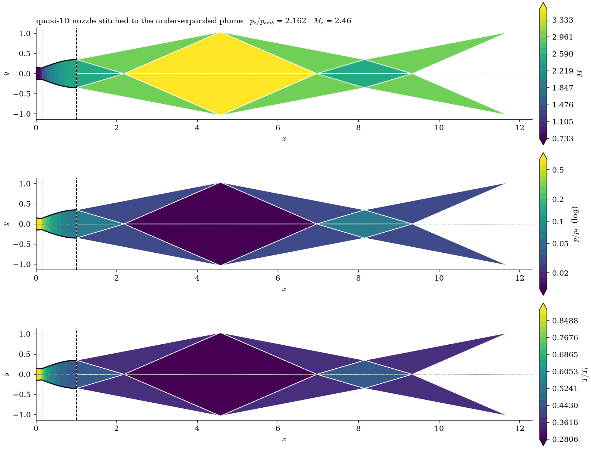

# 2D Discontinuous Galerkin nozzle code

[](https://github.com/astral-sh/ruff)
[](https://github.com/codespell-project/codespell)
[](docs/)
[](LICENSE)

A 2D discontinuous Galerkin solver for the compressible Euler equations, built
as a **teaching code for nozzle design studies**.

Written for **ENGN1700 — High Reynolds Number Flows**, Brown University School
of Engineering.

You change the geometry, sweep it, and take sensitivities. You do not write the
solver — it is already written, verified, and fast.


```python
from src import solve_nozzle, performance

result = solve_nozzle(area_ratio=3.0, back_pressure_ratio=0.12, order=1)
print(performance(result).summary())
```

---

## Quick start

You need Python 3.10+ and nothing else — there is no install step and nothing
to compile.

```bash
git clone https://github.com/mrodrig6/dg.git
cd dg
./dg2d.sh check                 # what is available
./dg2d.sh solve area_ratio=3.0 back_pressure_ratio=0.12 order=1
```

`check` reports a `NO` for each optional piece you are missing; `./dg2d.sh
install` adds them all. A solve prints its convergence history and then:

```
thrust        0.054007  (c_F = 0.193026, 92.24% of ideal)
  wall form   0.053504  (imbalance 9.31e-03)
mass flow     in 0.301234, out 0.301633  (imbalance 1.32e-03)
exit          M = 2.7188, p/p_t = 0.05041
entropy error 1.8657e-02
```

Run a worked case, or list them all:

```bash
./dg2d.sh list
./dg2d.sh run sweep             # examples/02_sweep.py
```

### Checking it still works

There is **no CI** — nothing runs on push, and no service decides whether a
change is good. You do, on your own machine:

```bash
./dg2d.sh verify                # tests, lint, format, spelling
./dg2d.sh verify --fast         # same, minus the full solves (seconds, not minutes)
./dg2d.sh test tests/test_physics.py -k roe     # one file, or one test
```

`verify` skips any step whose tool is not installed and says so, rather than
failing — a missing linter is not a broken solver. It exits non-zero if anything
that did run failed.

→ Full launcher reference and the Python API: **[`docs/usage.md`](docs/usage.md)**

---

## What it does

**Solves.** Nodal DG on triangles or quads, polynomial order 0–4, curved
elements, marched to steady state. Two interface fluxes: Roe with the
Harten–Hyman entropy fix (the default) and HLLC with Batten's wave speeds.
→ [`docs/theory.md`](docs/theory.md)

**Designs.** Five contour families (conical, smooth, bell, method-of-
characteristics, Bézier), each parameterised so you can sweep or optimise it.
→ [`docs/usage.md`](docs/usage.md#design-variables)

**Differentiates.** Adjoint gradients through the whole solve via JAX, verified
against finite differences, so shape optimisation costs one adjoint rather than
one solve per variable. → [`docs/workflows.md`](docs/workflows.md)

**Looks outside the nozzle.** A nozzle designed to be shock free inside has its
whole wave system *outside* the exit, so `src/external/` computes that in closed
form — the lip wave and the repeating shock-cell pattern downstream. One
command draws the whole flow in a single frame: quasi-1D inside the nozzle,
stitched at the exit plane to the wave-cell march outside.
→ [`docs/workflows.md`](docs/workflows.md)



Everything drawn is a ratio — $M$, $p/p_t$, $T/T_t$ — because the two regions
report in different units. The small step in colour at the dashed exit line is
not a drawing artefact: inside is quasi-1D theory, outside is a march started
from the *computed* exit state, and the gap between them is the
two-dimensionality of the exit flow.

**Runs fast.** A Numba backend with fused Runge–Kutta stages, a NumPy reference
backend, and JAX for gradients. → [`docs/performance.md`](docs/performance.md)

---

## Where to read next

| If you want to | Read |
|---|---|
| Drive the code — launcher, Python API, design variables, resolution | [`docs/usage.md`](docs/usage.md) |
| Do something with it — sweeps, sensitivity, optimisation, external flow | [`docs/workflows.md`](docs/workflows.md) |
| Understand the formulation — equations, DG weak form, fluxes, limiters, adjoint | [`docs/theory.md`](docs/theory.md) |
| Set exercises for students | [`docs/lab_guide.md`](docs/lab_guide.md) |
| Know how fast it is and why | [`docs/performance.md`](docs/performance.md) |
| Check it is right, or fix a misbehaving run | [`docs/verification.md`](docs/verification.md) |
| Rebuild the figures | [`docs/README.md`](docs/README.md) |

Worked, runnable cases live in [`examples/`](examples/) — start with
[`examples/01_solve.py`](examples/01_solve.py).

---

## Assumptions and constraints

Every result from this code is conditional on the following. None of them is a
bug or a gap to be filled later; they are the modelling choices that define what
the solver *is*, and reading a result without them is the main way to misuse it.

**Physical assumptions**

| | Assumption | Consequence |
|---|---|---|
| 1 | **Inviscid.** The Euler equations — no viscosity, no boundary layer, no heat conduction | No skin friction, no separation, no viscous losses. Despite the course title, Reynolds number does not appear anywhere: the model is the high-Re *limit*, not a high-Re flow |
| 2 | **Calorically perfect gas**, constant $\gamma = 1.4$ | No dissociation or vibrational excitation; not valid for the very hot exhaust of a real rocket |
| 3 | **Adiabatic**, no body forces | Total enthalpy is conserved, and is the check used to verify the solver |
| 4 | **Steady** | Marched in pseudo-time to a fixed point. Unsteady phenomena — buzz, screech, transient start-up — are outside the model, not merely unresolved |
| 5 | **Two-dimensional planar**, unit depth | A channel, not a body of revolution. Area is the channel height, so isentropic tables apply directly, but thrust is per unit depth and an axisymmetric nozzle is a *different* problem |
| 6 | **Symmetric about the axis** | Only the upper half is meshed. Asymmetric modes cannot be represented, so they can neither be found nor ruled out |

**Numerical and operational constraints**

| | Constraint | Consequence |
|---|---|---|
| 7 | **No shock inside the diverging section.** Back-pressure ratios between the second and first critical values are *refused* | The march does not reach a steady state there, so rather than return numbers that look like an answer, `solve_nozzle` raises and names the band. `allow_shock_in_nozzle=True` opts back in and reports `converged=False` |
| 8 | **Shocks outside the exit are not computed**, only evaluated in closed form | `src/external/` gives the lip wave and the shock-cell pattern from the exit state. It is not a plume solver: the barrel shock and Mach disc need the external region in the mesh |
| 9 | **Non-dimensional throughout** | No SI anywhere. $p_t = T_t = L = 1$ and $R = \gamma - 1$, giving $\rho_t = 2.5$ and $a_t = 0.7483$. Compare runs with `thrust_coefficient` and `discharge_coefficient`, not raw `thrust` |
| 10 | **Gradients are of the discrete problem** | Which is what optimisation needs — but use a shock-free point: a limiter switching on and off introduces kinks |

Constraint 7 is not a restriction on nozzle *design* — it is most of the point
of it. Sizing a nozzle means avoiding a shock in the diverging section, and the
interesting waves form outside the exit plane, which is what `src/external/`
draws.

→ [`docs/theory.md`](docs/theory.md#a-limitation-shocked-operating-points) and
[`docs/usage.md`](docs/usage.md#units-the-solver-is-non-dimensional)

---

## Licence

This project is licensed under the MIT License — see the [`LICENSE`](LICENSE)
file for details.

Copyright (c) 2026 Mauro Rodriguez
