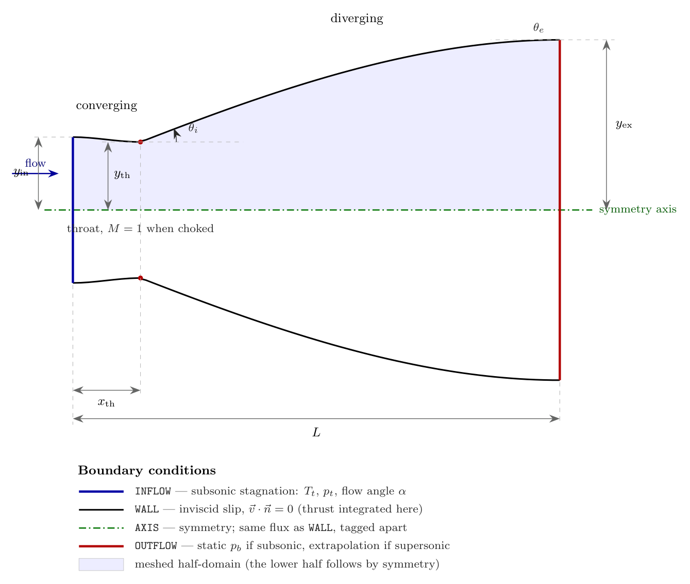
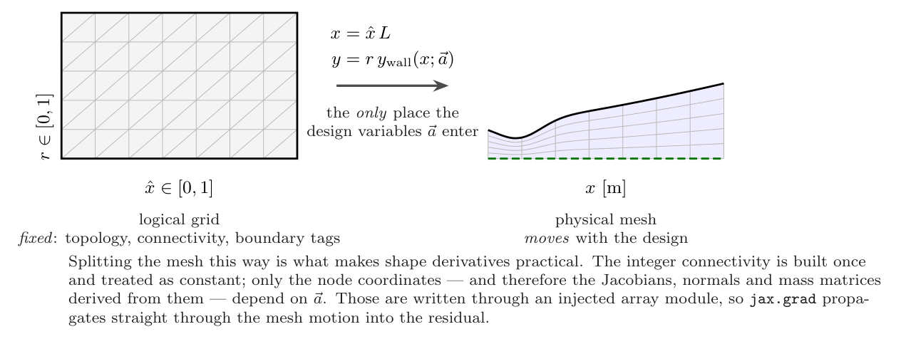
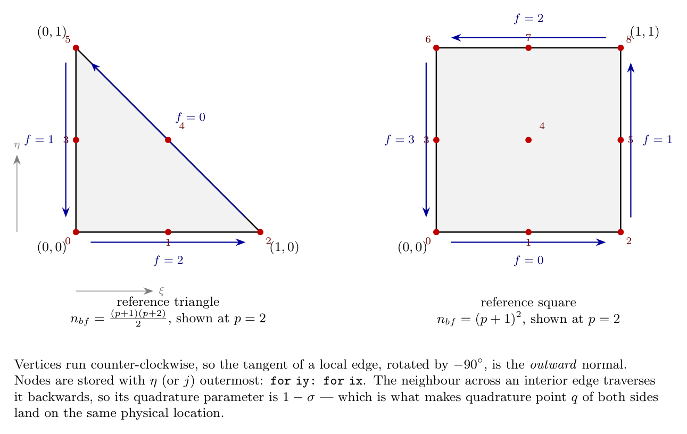
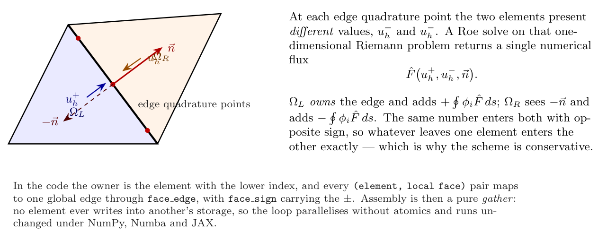

# dgnozzle — formulation, geometry and verification

A discontinuous Galerkin solver for planar nozzle design.

This document defines the problem `dgnozzle` solves and the scheme it uses. The
governing equations are the two-dimensional compressible Euler equations,
discretised by a nodal discontinuous Galerkin method on triangles or
quadrilaterals with a Roe numerical flux, and marched to steady state in
pseudo-time. The geometry is a planar converging–diverging nozzle whose wall is
parameterised by a small number of design variables.

The solver is intended for **design studies**: you are expected to change the
geometry, sweep it, and take sensitivities, not to modify the discretisation.
[Verification](#verification) reports the evidence, including observed orders of
accuracy.

---

## Contents

- [Scope and conventions](#scope-and-conventions)
- [Governing equations](#governing-equations)
- [Nozzle geometry](#nozzle-geometry)
- [Discretisation](#discretisation)
- [Numerical flux](#numerical-flux)
- [Boundary conditions](#boundary-conditions)
- [Time integration](#time-integration)
- [Limiting](#limiting)
- [Quasi-one-dimensional reference solution](#quasi-one-dimensional-reference-solution)
- [Performance metrics](#performance-metrics)
- [Verification](#verification)
- [A limitation: shocked operating points](#a-limitation-shocked-operating-points)
- [Design sensitivities](#design-sensitivities)
- [Implementation](#implementation)
- [References](#references)

---

## Scope and conventions

The solver computes steady, inviscid, compressible flow through a planar
converging–diverging nozzle. *Planar* means the channel is two-dimensional and
of unit depth, not axisymmetric. One consequence matters throughout: the
one-dimensional *area* is the channel height, so

```math
A(x) = 2\,y_{\mathrm{wall}}(x),
\qquad
\frac{A_{\mathrm{exit}}}{A_{\mathrm{throat}}}
= \frac{y_{\mathrm{wall}}(L)}{y_{\mathrm{throat}}}
\equiv \mathrm{AR}.
```

Isentropic tables may be used directly, because the area–Mach relation depends
on $A/A^{*}$ and not on the cross-section's shape.

Only the upper half of the channel is meshed; the lower half follows by symmetry
about $y = 0$. All reported *integral* quantities (thrust, mass flow) are
doubled to describe the full channel per unit depth.

### Notation

Vectors and tensors are set bold. Latin symbols take upright bold,
$\mathbf{U}$, $\mathbf{F}$, $\mathbf{n}$; Greek symbols take bold italic,
$\boldsymbol{\psi}$, because `\mathbf` has no effect on a Greek glyph. Velocity
is the vector $\mathbf{v}$, and its components are the scalars $v_x$ and $v_y$:

```math
\mathbf{v} = (v_x,\ v_y)^{T},
\qquad
v_n = \mathbf{v}\cdot\mathbf{n} = v_x n_x + v_y n_y,
\qquad
\mathbf{v}_t = \mathbf{v} - v_n \mathbf{n}.
```

The code follows the same convention: `vx`, `vy`, `vn`, `vt`. A subscript $n$ on
a flux means the same projection, $\mathbf{F}_n = \mathbf{F} n_x + \mathbf{G} n_y$.

Everything bold here is Latin or Greek, deliberately. A bold calligraphic
letter for the flux pair would read well in print, but
`\boldsymbol{\mathcal{F}}` renders *unbold* on GitHub: KaTeX accepts it, finds
no bold calligraphic glyph in its fonts, and silently drops the weight — so the
projected flux is written out instead.

### Non-dimensionalisation

The reference state is the inlet reservoir. With $p_t = 1$, $T_t = 1$,
$R = 0.4$ and $\gamma = 1.4$ the stagnation speed of sound and density are

```math
a_t = \sqrt{\gamma R T_t} = 0.74833,
\qquad
\rho_t = \frac{\gamma p_t}{a_t^{2}} = 2.5 .
```

Every reported quantity is in these units unless stated otherwise.

---

## Governing equations

The two-dimensional Euler equations in conservative form are

```math
\frac{\partial \mathbf{U}}{\partial t}
+ \frac{\partial \mathbf{F}}{\partial x}
+ \frac{\partial \mathbf{G}}{\partial y} = \mathbf{0},
```

with

```math
\mathbf{U} =
\begin{pmatrix} \rho \\ \rho v_x \\ \rho v_y \\ \rho E \end{pmatrix},
\qquad
\mathbf{F} =
\begin{pmatrix} \rho v_x \\ \rho v_x^{2} + p \\ \rho v_x v_y \\ \rho v_x H \end{pmatrix},
\qquad
\mathbf{G} =
\begin{pmatrix} \rho v_y \\ \rho v_x v_y \\ \rho v_y^{2} + p \\ \rho v_y H \end{pmatrix}.
```

The system is closed by the ideal-gas relation and the definition of total
enthalpy,

```math
p = (\gamma - 1)\left(\rho E - \tfrac{1}{2}\rho\,|\mathbf{v}|^{2}\right),
\qquad
H = E + \frac{p}{\rho},
\qquad
a = \sqrt{\frac{\gamma p}{\rho}} .
```

It is convenient to write the flux projected onto a direction
$\mathbf{n} = (n_x, n_y)$,

```math
\mathbf{F}_n(\mathbf{U})
\;\equiv\; \mathbf{F} n_x + \mathbf{G} n_y
=
\begin{pmatrix}
  \rho v_n \\ \rho v_x v_n + p\,n_x \\ \rho v_y v_n + p\,n_y \\ \rho H v_n
\end{pmatrix},
```

since every boundary and interface term below is of this form. The flux
Jacobian $\partial\mathbf{F}_n/\partial\mathbf{U}$ has eigenvalues

```math
\lambda = \{\,v_n + a,\; v_n - a,\; v_n,\; v_n\,\},
```

whose signs determine how many conditions may be imposed at a boundary
([Boundary conditions](#boundary-conditions)).

---

## Nozzle geometry



*Nozzle geometry, design variables and boundary conditions. The shaded region
is the half-domain that is actually meshed. The wall shown is the `'bell'`
contour at $\mathrm{AR} = 2.5019$, $x_{\mathrm{th}} = 0.1388$.*

### Design variables

The wall half-height $y_{\mathrm{wall}}(x; \mathbf{a})$ is controlled by

```math
\mathbf{a} = \bigl(\mathrm{AR},\; x_{\mathrm{th}},\; y_{\mathrm{th}},\;
              y_{\mathrm{in}},\; L,\; \theta_i,\; \theta_e,\; w_1,\; w_2\bigr),
```

every one of which is differentiable ([Design sensitivities](#design-sensitivities)).

| Symbol | Code name | Meaning |
|---|---|---|
| $\mathrm{AR}$ | `area_ratio` | exit-to-throat area ratio |
| $x_{\mathrm{th}}$ | `throat_x` | throat location as a fraction of $L$ |
| $y_{\mathrm{th}}$ | `throat_half_height` | throat half-height [m]; scales the nozzle |
| $y_{\mathrm{in}}$ | `inlet_half_height` | inlet half-height [m]; must exceed $y_{\mathrm{th}}$ |
| $L$ | `length` | axial length [m] |
| $\theta_i$ | `theta_initial_deg` | wall angle just downstream of the throat |
| $\theta_e$ | `theta_exit_deg` | wall angle at the exit plane |
| $w_1, w_2$ | `bezier_w1` / `bezier_w2` | Bézier shape weights |

### Converging section

For $x \le x_{\mathrm{th}} L$, with $s = x/(x_{\mathrm{th}} L) \in [0,1]$, the
wall is a cubic Hermite with zero slope at both ends,

```math
y_{\mathrm{wall}}(s) = h_{00}(s)\, y_{\mathrm{in}} + h_{01}(s)\, y_{\mathrm{th}},
\qquad
\begin{aligned}
  h_{00}(s) &= 2s^{3} - 3s^{2} + 1, \\
  h_{01}(s) &= -2s^{3} + 3s^{2}.
\end{aligned}
```

Because $y'(x_{\mathrm{th}}^{-}) = 0$, the point $x_{\mathrm{th}}$ really is a
stationary point of the wall, so "throat" and "$x_{\mathrm{th}}$" agree.

### Diverging section

For $x > x_{\mathrm{th}} L$, with
$s = (x - x_{\mathrm{th}}L)/(L - x_{\mathrm{th}}L)$ and
$y_{\mathrm{ex}} = \mathrm{AR}\,y_{\mathrm{th}}$, five families are available.

**`'conical'` — straight wall.**

```math
y_{\mathrm{wall}} = y_{\mathrm{th}} + (y_{\mathrm{ex}} - y_{\mathrm{th}})\, s .
```

**`'bell'` and `'moc'` — prescribed wall angles.** A cubic Hermite with slopes
$\tan\theta_i$ and $\tan\theta_e$ (converted to the $s$ variable through
$\mathrm{d}x/\mathrm{d}s$):

```math
y_{\mathrm{wall}} = h_{00} y_{\mathrm{th}} + h_{10} m_i
                  + h_{01} y_{\mathrm{ex}} + h_{11} m_e ,
\qquad
\begin{aligned}
  h_{10}(s) &= s^{3} - 2s^{2} + s, \\
  h_{11}(s) &= s^{3} - s^{2},
\end{aligned}
```

with $m_i = \tan\theta_i \cdot \mathrm{d}x/\mathrm{d}s$ and similarly for
$m_e$. `'moc'` fixes $\theta_i = 30^{\circ}$, $\theta_e = 0$, the classical Rao
values.

> **A slope discontinuity, on purpose.** With $\theta_i > 0$ the wall slope
> jumps from $0$ to $\tan\theta_i$ at the throat. That sharp corner is the
> idealisation used in minimum-length nozzle design — it launches a centred
> Prandtl–Meyer expansion fan — and it is *not* a defect. It does, however, put
> a singularity into the exact solution, which caps the achievable order of
> accuracy. [Verification](#order-of-accuracy) quantifies this. Use `'smooth'`
> or `'analytic'` for convergence studies.

**`'smooth'` — $C^1$ throat.** The `'bell'` form with $\theta_i = 0$, so the
wall slope is continuous across the throat and the exact solution is smooth.

**`'bezier'` — two shape weights.** A cubic Bézier in $s$ with interior control
values $c_k = y_{\mathrm{th}} + w_k (y_{\mathrm{ex}} - y_{\mathrm{th}})$:

```math
y_{\mathrm{wall}} = (1-s)^{3} y_{\mathrm{th}} + 3(1-s)^{2} s\, c_1
  + 3(1-s) s^{2} c_2 + s^{3} y_{\mathrm{ex}} .
```

$(w_1, w_2) = (\tfrac13, \tfrac23)$ reproduces the conical wall; $w_1 = 0$ gives
a $C^1$ throat. This is the most convenient family for gradient-based shape
optimisation, because $w_1$ and $w_2$ are bounded, dimensionless, and act
locally.

**`'analytic'` — a closed-form verification contour.** A fixed shape, smooth
everywhere,

```math
t(x) = \pi \ln\!\bigl(1 + (e^{2}-1)\,x/L\bigr),
\qquad
y_{\mathrm{wall}} = 0.01\left(4 - \cos\tfrac{t}{2}\right)
                    \left(\cos t + 5 - \cos\tfrac{t}{2}\right),
```

which runs from $y = 0.15$ at the inlet through a throat of $0.13989434$ at
$x = 0.138805$ to $y = 0.35$ at the exit, an area ratio of $2.50189$. It
ignores `area_ratio` and `throat_x`; it exists so that results can be checked
against a fixed reference geometry with no throat corner.

---

## Discretisation

### Mesh



*The mesh is built as a fixed logical grid plus a design-dependent map. Only
the map depends on $\mathbf{a}$, which is what makes shape derivatives
tractable.*

A structured $n_x \times n_r$ grid of cells is laid out in logical coordinates
$(\hat{x}, r) \in [0,1]^2$ and mapped to the nozzle by

```math
x = \hat{x} L, \qquad y = r\, y_{\mathrm{wall}}(x; \mathbf{a}).
```

Each cell becomes one quadrilateral or two triangles. Refinement level
$\mathrm{ref}$ subdivides each cell $2^{\mathrm{ref}}$ ways per direction, so
the element count is $n_x n_r 4^{\mathrm{ref}}$ (doubled for triangles).

Axial nodes may be clustered toward the throat, where the solution varies
fastest. The base distribution is generated from a target spacing

```math
h(\hat{x}) = 1 + (\sigma - 1)
  \left(1 - e^{-\left((\hat{x} - x_{\mathrm{th}})/w\right)^{2}}\right),
```

integrated and inverted, with $\sigma$ the far-field-to-throat spacing ratio.
Refinement then subdivides that base distribution linearly, so the node set at
one refinement level is a subset of the next.

### Reference elements



*Reference elements, Lagrange node ordering and local edge numbering.*

The solution is expanded in a nodal Lagrange basis of order $p$ on each element,

```math
\mathbf{U}_h(\mathbf{x})\big|_{\Omega_e}
= \sum_{i=1}^{n_{bf}} \mathbf{U}_{e,i}\, \phi_i(\xi, \eta),
\qquad
n_{bf} =
\begin{cases}
  \tfrac{1}{2}(p+1)(p+2) & \text{triangle},\\
  (p+1)^{2}              & \text{quadrilateral}.
\end{cases}
```

The element geometry uses an independent Lagrange basis of order $Q$, so $Q = 1$
gives straight-sided elements and $Q = 2$ a quadratic (curved) wall. The
mapping from reference to physical coordinates and its Jacobian are

```math
\mathbf{x}(\xi,\eta) = \sum_{n} \mathbf{x}_n\, \psi_n(\xi,\eta),
\qquad
\mathbf{J} = \frac{\partial(x,y)}{\partial(\xi,\eta)},
\qquad
\nabla_{\mathbf{x}}\phi_i = \mathbf{J}^{-T}\nabla_{(\xi,\eta)}\phi_i .
```

### Weak form

Multiplying the Euler equations by a test function $\phi_i$, integrating over an
element and applying the divergence theorem gives the discrete statement

```math
\int_{\Omega_e} \phi_i \frac{\partial \mathbf{U}_h}{\partial t}\,\mathrm{d}\Omega
=
\int_{\Omega_e} \left(\frac{\partial \phi_i}{\partial x}\mathbf{F}
  + \frac{\partial \phi_i}{\partial y}\mathbf{G}\right)\mathrm{d}\Omega
- \oint_{\partial \Omega_e} \phi_i\,
  \hat{\mathbf{F}}\bigl(\mathbf{U}_h^{+}, \mathbf{U}_h^{-}, \mathbf{n}\bigr)\,\mathrm{d}s
```

for every basis function $i$ and every element $e$. Writing the right-hand side
as $-\mathbf{R}_e$ leaves the semi-discrete system

```math
\mathbf{M}_e\, \dot{\mathbf{U}}_e = -\mathbf{R}_e(\mathbf{U}),
\qquad
(\mathbf{M}_e)_{ij} = \int_{\Omega_e} \phi_i \phi_j\,\mathrm{d}\Omega .
```

The mass matrix is block diagonal — an element couples to itself only — so
$\mathbf{M}^{-1}$ is applied as $n_{elem}$ independent
$n_{bf} \times n_{bf}$ solves.



*Elements communicate only through the numerical flux on their shared edge. The
same value enters both with opposite sign, which is what makes the scheme
conservative.*

### Quadrature

Volume integrals use symmetric positive-weight rules on the triangle (a
Duffy-collapsed Gauss–Jacobi rule for degree $\ge 3$) and tensor-product
Gauss–Legendre on the quadrilateral; edge integrals use Gauss–Legendre on
$[0,1]$. The degrees are

```math
d_{\mathrm{vol}} = 2p + 1 + 2(Q-1),
\qquad
d_{\mathrm{edge}} = 2p + Q .
```

> **Positive weights are not optional.** The Dunavant degree-3 rule used by the
> original code has a negative first weight, $-0.28125$. A negative weight can
> destroy the positive definiteness of $\mathbf{M}_e$ and lets the entropy-error
> integral — a sum of squares — go negative. Every rule here has strictly
> positive weights, checked against exact monomial integrals in the test suite.

---

## Numerical flux

The interface flux is Roe's approximate Riemann solver,

```math
\hat{\mathbf{F}}(\mathbf{U}^{+}, \mathbf{U}^{-}, \mathbf{n})
= \tfrac{1}{2}\left(\mathbf{F}_n(\mathbf{U}^{+})
                  + \mathbf{F}_n(\mathbf{U}^{-})\right)
- \tfrac{1}{2}\left|\hat{\mathbf{A}}\right|
  \left(\mathbf{U}^{-} - \mathbf{U}^{+}\right),
```

where $\hat{\mathbf{A}}$ is the flux Jacobian evaluated at the Roe-averaged
state

```math
\hat{v}_x = \frac{\sqrt{\rho^{+}}\,v_x^{+} + \sqrt{\rho^{-}}\,v_x^{-}}
               {\sqrt{\rho^{+}} + \sqrt{\rho^{-}}},
\quad \text{(and likewise for } \hat{v}_y,\ \hat{H}\text{)},
\qquad
\hat{a}^{2} = (\gamma - 1)\left(\hat{H} - \tfrac{1}{2}|\hat{\mathbf{v}}|^{2}\right).
```

The dissipation term is evaluated in factored form rather than by assembling
$|\hat{\mathbf{A}}|$: with $\Delta(\cdot) = (\cdot)^{-} - (\cdot)^{+}$,

```math
\begin{aligned}
  G_1 &= (\gamma-1)\left(\tfrac{1}{2}|\hat{\mathbf{v}}|^{2}\Delta\rho
         - \hat{v}_x\,\Delta(\rho v_x) - \hat{v}_y\,\Delta(\rho v_y)
         + \Delta(\rho E)\right),\\
  G_2 &= -\hat{v}_n \Delta\rho + \Delta(\rho v_x)\, n_x
         + \Delta(\rho v_y)\, n_y,\\
  s_1 &= \tfrac{1}{2}\left(|\lambda_1| + |\lambda_2|\right), \qquad
  s_2 = \tfrac{1}{2}\left(|\lambda_1| - |\lambda_2|\right),\\
  C_1 &= \frac{G_1}{\hat{a}^{2}}\left(s_1 - |\lambda_3|\right)
         + \frac{G_2}{\hat{a}} s_2,
  \qquad
  C_2 = \frac{G_1}{\hat{a}} s_2 + \left(s_1 - |\lambda_3|\right) G_2 .
\end{aligned}
```

### Entropy fix

An unmodified Roe flux admits a non-physical expansion shock where an
eigenvalue passes through zero — which happens at the throat of every choked
nozzle. The Harten–Hyman fix replaces small eigenvalues by a smooth quadratic,

```math
|\lambda| \leftarrow
\begin{cases}
  \dfrac{\lambda^{2} + \epsilon^{2}}{2\epsilon}, & |\lambda| < \epsilon,\\
  |\lambda|, & \text{otherwise},
\end{cases}
\qquad \epsilon = 0.05\,\hat{a}.
```

Note what this fix is and is not. It is a *local repair* that rules out one
specific non-physical solution, and it proves nothing globally. It is **not**
entropy stability in the modern sense — a provable discrete entropy inequality,
built from an entropy-conservative two-point flux (Ismail and Roe; Tadmor) on
summation-by-parts operators. Roe contributed to both lines of work two decades
apart, which makes them easy to conflate, but only the second is a theorem.

### HLLC, and why it is the robust choice

`flux='hllc'` selects HLLC with Batten's wave-speed estimates: three waves —
two acoustic and the contact — instead of a full eigen-decomposition.

```math
\hat{\mathbf{F}} = \begin{cases}
    \mathbf{F}_L, & 0 \le S_L,\\
    \mathbf{F}_L + S_L(\mathbf{U}^{*}_L - \mathbf{U}_L), & S_L \le 0 \le S_M,\\
    \mathbf{F}_R + S_R(\mathbf{U}^{*}_R - \mathbf{U}_R), & S_M \le 0 \le S_R,\\
    \mathbf{F}_R, & S_R \le 0,
\end{cases}
```

with the star states carrying the contact's normal velocity and each side's own
tangential velocity,

```math
\rho^{*}_K = \rho_K \frac{S_K - v_{nK}}{S_K - S_M}, \qquad
\mathbf{v}^{*}_K = \mathbf{v}_K + (S_M - v_{nK})\,\mathbf{n},
```

```math
E^{*}_K = E_K + (S_M - v_{nK})
    \left(S_M + \frac{p_K}{\rho_K (S_K - v_{nK})}\right),
```

and Batten's estimates, which are what make the scheme positivity-preserving:

```math
S_L = \min(v_{nL} - a_L,\ \tilde{v}_n - \tilde{a}), \qquad
S_R = \max(v_{nR} + a_R,\ \tilde{v}_n + \tilde{a}).
```

Restoring the contact wave is what separates HLLC from HLL, whose missing middle
wave smears every shear layer.

**It supplies an assumption this code was relying on without having.** The
Zhang–Shu positivity limiter has a theorem, and that theorem *assumes* the
underlying first-order flux is positivity-preserving. HLLC with Batten's speeds
provably is; the Roe flux, with or without the entropy fix, is not. Under
`flux='roe'` the limiter has therefore been running without its central
hypothesis.

**And there is nothing to tune.** The HLL family cannot produce an
entropy-violating expansion shock, so HLLC needs no entropy fix and carries no
constant — `entropy_fix` is simply unread. A test checks the mass flux passes
smoothly through $M = 1$, which is exactly where the Roe flux needs its patch.

Measured against Roe on the shock-free design point, the answers agree to about
1% in thrust, HLLC converges in 451 iterations against Roe's 751 at $p = 0$, and
Roe is consistently the **more accurate** of the two — entropy error
$3.8\times10^{-3}$ against $6.2\times10^{-3}$ at $p = 1$, and
$1.3\times10^{-3}$ against $3.7\times10^{-3}$ at $p = 2$. That is the expected
trade: HLLC's three-wave model is more dissipative than Roe's full
decomposition. On the shocked point at $p = 0$ HLLC stalls at
$8.8\times10^{-2}$ where Roe stalls at $1.4\times10^{-1}$.

`hllc_low_mach` enables the low-Mach correction of Fleischmann et al., scaling
the acoustic wave speeds by
$\phi = \min(1,\ \max(|M_L|, |M_R|)/M_{\mathrm{lim}})$ while leaving the contact
untouched. `0` disables it and gives standard HLLC, which is the verified path;
the form follows the paper, so check the cutoff constant against it before
relying on that branch quantitatively.

---

## Boundary conditions

The number of conditions that may be imposed equals the number of *incoming*
characteristics, read off the flux-Jacobian eigenvalues with $\mathbf{n}$ the
outward normal.

### Inviscid wall and symmetry axis

Both are impermeable: $\mathbf{v}\cdot\mathbf{n} = 0$. Removing the normal
velocity and recovering the pressure from the remaining energy gives a flux
that transmits pressure but no mass or energy,

```math
p_b = (\gamma - 1)\left(\rho E
      - \tfrac{1}{2}\rho\,|\mathbf{v}_{t}|^{2}\right),
\qquad
\hat{\mathbf{F}} = \bigl(0,\; p_b n_x,\; p_b n_y,\; 0\bigr)^{T}.
```

The contoured wall and the symmetry axis use the same flux but carry different
tags, so that thrust can be integrated over the wall alone.

### Subsonic stagnation inflow

Three characteristics enter, one leaves. The outgoing one carries the interior
Riemann invariant

```math
J^{+} = v_n + \frac{2a}{\gamma - 1}.
```

Combining it with the isentropic stagnation relations and a prescribed flow
direction $\hat{\mathbf{d}} = (\cos\alpha, \sin\alpha)$ gives a quadratic for
the inflow Mach number,

```math
\underbrace{\left(\tfrac{\gamma-1}{2}\beta - n_d^{2}\right)}_{A} M^{2}
\underbrace{-\,\tfrac{4 n_d}{\gamma-1}}_{B} M
+ \underbrace{\left(\beta
  - \left(\tfrac{2}{\gamma-1}\right)^{2}\right)}_{C}
= 0,
\qquad
\beta = \left(\frac{J^{+}}{a_t}\right)^{2},\quad
n_d = \mathbf{n}\cdot\hat{\mathbf{d}}.
```

The *smallest non-negative* root is the physical branch; the boundary state then
follows from the isentropic relations and total enthalpy
$H_b = a_t^{2}/(\gamma-1)$.

> **Root selection.** Taking $(-B + \sqrt{B^{2}-4AC})/2A$ unconditionally is
> correct only while $A > 0$. When the leading coefficient changes sign — which
> happens for weak inflow — that root is negative and the boundary state becomes
> meaningless. The smallest non-negative root is the physical branch in every
> case.

### Outflow

If $v_n/a \ge 1$ the outflow is supersonic: no characteristic enters, nothing
may be imposed, and the interior state is extrapolated. If it is subsonic,
exactly one condition is admissible. Static pressure is set to $p_b$, while
entropy and the outgoing invariant are carried from the interior and the
tangential velocity is unchanged:

```math
\rho_b = \rho^{+}\left(\frac{p_b}{p^{+}}\right)^{1/\gamma},
\qquad
v_{n,b} = v_n^{+} + \frac{2}{\gamma-1}\left(a^{+} - a_b\right),
\qquad
\mathbf{v}_{t,b} = \mathbf{v}_t^{+} .
```

The two branches are selected by the local normal Mach number, so a shock
crossing the exit plane during the transient is handled without special cases.

> **Both branches are needed.** Extrapolating unconditionally would leave the
> back pressure with no effect on the flow at all, and with it every operating
> point whose exit is subsonic — which is to say every shocked one.

---

## Time integration

The semi-discrete system is marched in pseudo-time to steady state with an
element-local step,

```math
\Delta t_e
= \frac{\mathrm{CFL}}{2p+1}\,
  \frac{2 A_e}{\displaystyle\sum_{f \in \partial\Omega_e} s_f\, \ell_f},
```

where $A_e$ is the element area, $\ell_f$ the length of face $f$ and $s_f$ the
maximum signal speed there. The $1/(2p+1)$ factor is the standard
order-dependent restriction for explicit DG, and $\mathrm{CFL}$ means what it
usually does: a multiplier on that stable step.

### What CFL is safe

The textbook restriction is a bound, not an equality, and measurement says it is
much tighter than it needs to be above $p = 0$. Bisecting the largest
$\mathrm{CFL}$ at which the march still converges — over the `bell` and
`smooth` contours at refinement levels 0 and 1, the two agreeing to within a
bisection step at every order — gives

| $p$ | RK4 | SSP-RK3 | $\mathrm{CFL} = 1$ as a fraction of the RK4 limit |
|---|---|---|---|
| 0 | 1.625 | 1.437 | 62% |
| 1 | 2.625 | 2.337 | 38% |
| 2 | 2.500 | 2.240 | 40% |

So a single fixed $\mathrm{CFL}$ carries a different safety margin at every
order. The solver's default is therefore order-dependent — 70% of the measured
limit, so the *margin* is constant at 30% while the definition stays
conventional. Pass $\mathrm{CFL}$ explicitly and it means exactly what the
formula above says.

Read as a coefficient on the geometric step rather than as a $\mathrm{CFL}$
number, the stable value falls as $1 : 0.54 : 0.31$ across $p = 0, 1, 2$, which
$1/(p+1)$ fits ($1 : 0.5 : 0.33$) and $1/(2p+1)$ does not ($1 : 0.33 : 0.2$).
That is the scaling used beyond the measured orders. SSP-RK3 comes out at a
near-constant $0.89$ times RK4, a useful check on both columns: the two schemes
differ by a scheme factor, not by their order dependence.

> **A measurement, not a proof.** Two contours at one back pressure is a scan,
> not a stability analysis, which is why the default keeps 30% in hand rather
> than sitting on the limit. `tests/test_timestep.py` marches 400 steps at each
> tabulated limit, so a change to the flux, the quadrature or the limiter that
> moves the real limit fails the suite instead of silently invalidating the
> table.

Two schemes are available. `'rk4'` is the classical four-stage method, with the
local step frozen at the first stage (the intermediate stages are not meant to
be time-accurate). `'ssprk3'` is the three-stage
strong-stability-preserving method,

```math
\begin{aligned}
  \mathbf{U}^{(1)} &= \mathbf{U}^{n}
    + \Delta t\, \mathbf{L}(\mathbf{U}^{n}),\\
  \mathbf{U}^{(2)} &= \tfrac{3}{4}\mathbf{U}^{n} + \tfrac{1}{4}
    \left(\mathbf{U}^{(1)}
      + \Delta t\, \mathbf{L}(\mathbf{U}^{(1)})\right),\\
  \mathbf{U}^{n+1} &= \tfrac{1}{3}\mathbf{U}^{n} + \tfrac{2}{3}
    \left(\mathbf{U}^{(2)}
      + \Delta t\, \mathbf{L}(\mathbf{U}^{(2)})\right),
\end{aligned}
\qquad
\mathbf{L} = -\mathbf{M}^{-1}\mathbf{R}.
```

Each SSP stage is a convex combination of forward-Euler updates, which is
exactly the structure the positivity limiter assumes — so `'ssprk3'` plus
`'positivity'` carries a genuine positivity guarantee that `'rk4'` does not.

### Convergence measure

The march stops when

```math
\frac{\left\|\dot{\mathbf{U}}\right\|_{\mathrm{rms}}}{\rho_t a_t / L}
< \texttt{tolerance},
\qquad
\left\|\dot{\mathbf{U}}\right\|_{\mathrm{rms}}
= \sqrt{\frac{1}{4N}\sum \left(\mathbf{M}^{-1}\mathbf{R}\right)^{2}} .
```

The choice of denominator matters more than it looks. Testing the
*unnormalised* residual against a fixed threshold makes "converged" mean
different things on different meshes and at different operating points. But
testing it *relative to the first iteration* is no better: it demands a tighter
absolute residual the better the initial guess is, so improving the initial
condition makes the solver appear slower and two runs started differently cannot
be compared at all. A fixed physical scale, $\rho_t a_t / L$, is independent of
both the mesh and the starting field.

One further trap: the residual must be measured at a state the solver actually
holds, not at an intermediate Runge–Kutta stage, whose rate is not the residual
anywhere.

---

## Limiting

At $p = 0$ the solution is constant per element and cannot oscillate. At
$p \ge 1$ it can, and near a shock it does: the polynomial overshoots, pressure
or density goes negative at a quadrature point, and the Roe flux fails.

Both limiters act by shrinking the deviation from the cell average,

```math
\mathbf{U}_{e,i}^{\mathrm{lim}} = \bar{\mathbf{U}}_e
  + \theta_e \left(\mathbf{U}_{e,i} - \bar{\mathbf{U}}_e\right),
\qquad \theta_e \in [0,1],
```

which leaves the cell average untouched and is therefore *conservative*.

**Positivity (Zhang–Shu).** $\theta_e$ is the largest value keeping $\rho$ and
$p$ above small floors at every point the scheme evaluates — the volume
quadrature points and the element's own face quadrature points. The density
constraint is linear in $\theta$ and solved in closed form; the pressure
constraint is quadratic and bracketed by bisection. On a smooth solution
$\theta_e = 1$ everywhere and the limiter is exactly inactive, so full accuracy
is retained.

**Superbee (Roe).** A TVD slope limiter: it additionally bounds the element's
own increment toward each neighbour by what the jump in cell averages across
that face admits, damping the oscillations themselves rather than only their
consequences. Writing $d_f$ for the element's increment toward face $f$ and
$a_f$ for the jump in cell averages across it,

```math
\theta_e = \min_{f,\,s} \min\!\left(1,\
  \frac{\mathrm{superbee}(a_{f,s},\, d_{f,s})}{d_{f,s}}\right),
\qquad
\mathrm{superbee}(a, b) = \mathrm{maxmod}\bigl(
  \mathrm{minmod}(2a, b),\ \mathrm{minmod}(a, 2b)\bigr),
```

equivalently $\phi(r) = \max\bigl(0, \min(2r, 1), \min(r, 2)\bigr)$ with
$r = a/b$. Of the second-order TVD limiters Superbee is the most
*compressive* — it sits on the upper edge of Sweby's TVD region, where `minmod`
sits on the lower one, permitting twice the neighbour jump where `minmod`
permits one. That keeps a captured shock sharp, and it also makes Superbee the
most willing of the family to switch on.

Three details decide whether it is usable.

*One scalar factor, not one per component.* The minimum runs over the four
conserved components $s$ as well as the faces, so a single number scales the
whole element. That is a matter of admissibility, not tidiness. The set
$\{\rho > 0,\ p > 0\}$ is **convex**, so
$\bar{\mathbf{U}}_e + \theta(\mathbf{U}_{e,i} - \bar{\mathbf{U}}_e)$ is a convex
combination of two admissible states and is itself admissible for every
$\theta \in [0,1]$. A per-component factor leaves that segment — it pairs a
strongly limited density with a barely limited energy — and can land outside the
set even though both endpoints are inside it. Measured on the shocked case at
`cfl=0.3`, a per-component factor drove the *cell average* non-physical 10,246
times and the march to `NaN`; the scalar factor needed no repairs at all and
held the minimum pressure positive throughout.


*Boundary faces are not limited against.* An element is its own neighbour across
a domain boundary, so the jump there is identically zero; limiting against it
would drive $\theta_e$ to zero in exactly the elements carrying the wall and the
exit plane, which is where thrust is integrated.

*The TVB threshold.* Cockburn and Shu call this constant $M$. **This document does not**, because $M$ is the Mach number everywhere else in it and in the code; it is written $K_{\mathrm{TVB}}$ here and `tvb_constant` in the API. A face whose increment is small enough to be smooth data
rather than an oscillation is left alone, following Cockburn and Shu. Their
threshold is $K_{\mathrm{TVB}} h^2$, with $K_{\mathrm{TVB}}$ a bound on a second derivative; this code uses the
dimensionless equivalent

```math
|d_{f,s}| \le K_{\mathrm{TVB}}\, \frac{A_e}{A_\Omega}\, \max_{e'} |\bar{u}_{e',s}|
\quad\Longrightarrow\quad
\text{component } s \text{ is not limited across } f ,
```

so that one `tvb_constant` $= K_{\mathrm{TVB}}$ covers any geometry, any non-dimensionalisation
and any refinement level. The element's share of the domain area stands in for
$(h/L)^2$, so the threshold still shrinks as $h^2$ under refinement, which is
what makes the limiter vanish in the limit and recovers the TVB argument. The
state scale is the largest cell average of that component *anywhere in the
domain*, not the element's own — the transverse momentum passes through zero on
the nozzle axis, and a local scale would therefore drive the threshold to zero on
precisely the elements where the field is smoothest.

The threshold is not optional. Without it a TVD limiter stays marginally active
at every smooth extremum, clipping it on some iterations and not others, and a
limiter that switches on and off between iterations parks the residual at a fixed
level instead of converging. Measured at the shock-free design point, $K_{\mathrm{TVB}} = 0$
leaves 77 of 140 elements of an *already converged* field being clipped and the
residual parks at $3.1$ instead of reaching $10^{-6}$. This is the same failure
mode that made the Barth–Jespersen limiter this replaced *worse than no slope
limiter at all*, by more than an order of magnitude on the shocked case.

The shipped default is $K_{\mathrm{TVB}} = 50$, and it is the smallest value that works.
Scanned over the design, over-expanded and under-expanded points, at
$(p, \texttt{refine})$ of $(1,0)$, $(1,1)$ and $(2,0)$: $K_{\mathrm{TVB}} = 10$ fails all nine,
$K_{\mathrm{TVB}} = 20$ fails the three at $\texttt{refine}=1$, and $K_{\mathrm{TVB}} = 50$ converges all nine.

It is worth being honest about what that costs, because it is the central
difficulty of this whole section. At $K_{\mathrm{TVB}} = 50$ the slope limiter is nearly
inactive *even at a shock*: 200 steps into a shocked run it touches 0 of 140
elements at $p_b/p_t = 0.50$ and 2 of 140 at $0.70$, where $K_{\mathrm{TVB}} = 0$ touches 72 and
92. For this problem the window in which one TVB constant both leaves a smooth
steady solution alone and still bites on a shock is **empty**. Lower $K_{\mathrm{TVB}}$ and the
limiter chatters and the residual parks; raise it and the limiter stops acting.
That is a property of asking a TVD limiter — designed for a time-accurate march,
where a little chatter is harmless — to coexist with a *steady* pseudo-time march
whose whole purpose is to drive a residual to zero. It is the reason shocked
operating points do not converge at $p \ge 1$, and it is not something a
different choice of TVD limiter function would fix. A shock-capturing method that
does converge in steady state — artificial viscosity with a smooth sensor, or a
subcell WENO reconstruction — would be a change of method, not a change of
limiter.

**When a limiter cannot help.** If the *cell average* itself becomes
non-physical, no scaling can repair it — at $\theta = 0$ the solution *is* that
average. The code then floors the average minimally, counts the repair, and
reports it; a run needing repairs should be rerun with a smaller `cfl`.
Separately, a limiter that switches on and off between iterations parks the
residual at a fixed level instead of converging. The solver detects that limit
cycle, stops, and says so.

---

## Quasi-one-dimensional reference solution

Quasi-1D theory serves two purposes: it is an exact reference to compare
against, and it is the initial condition. As a starting field it saves a modest
number of iterations (about 15% at $p = 0$, 3% at $p = 1$ on the reference
case); its real value is robustness, since at $p = 2$ without $p$-continuation a
uniform start diverges where the quasi-1D start converges.

The area–Mach relation is

```math
\frac{A}{A^{*}} = \frac{1}{M}
\left[\frac{2}{\gamma+1}\left(1 + \frac{\gamma-1}{2}M^{2}\right)
\right]^{\frac{\gamma+1}{2(\gamma-1)}},
```

monotone on each of the subsonic and supersonic branches and therefore
invertible by bracketed bisection. The isentropic relations give

```math
\frac{p}{p_t} = \left(1 + \tfrac{\gamma-1}{2}M^{2}\right)^{-\frac{\gamma}{\gamma-1}},
\qquad
\frac{\rho}{\rho_t} = \left(1 + \tfrac{\gamma-1}{2}M^{2}\right)^{-\frac{1}{\gamma-1}},
\qquad
\frac{T}{T_t} = \left(1 + \tfrac{\gamma-1}{2}M^{2}\right)^{-1}.
```

Across a normal shock,

```math
M_2^{2} = \frac{1 + \frac{\gamma-1}{2}M_1^{2}}
               {\gamma M_1^{2} - \frac{\gamma-1}{2}},
\qquad
\frac{p_2}{p_1} = \frac{2\gamma M_1^{2} - (\gamma-1)}{\gamma+1},
\qquad
\frac{A_2^{*}}{A_1^{*}} = \frac{p_{t1}}{p_{t2}} .
```

### Operating regimes

Three critical back-pressure ratios divide the operating map:

| Ratio | Condition | Regime below it |
|---|---|---|
| $(p_b/p_t)_1$ | $M = 1$ at the throat, subsonic exit | choked, shock in the diverging section |
| $(p_b/p_t)_2$ | normal shock at the exit plane | shock-free in the nozzle, over-expanded |
| $(p_b/p_t)_3$ | shock-free supersonic (design) | under-expanded |

Above $(p_b/p_t)_1$ the nozzle is not choked and the mass flow still depends on
back pressure. For the reference geometry ($\mathrm{AR} = 2.50189$,
$\gamma = 1.4$) the three ratios are $0.9609$, $0.4345$ and $0.06390$, with a
design exit Mach number of $2.4436$.

When a shock stands in the diverging section its position is found by bisection:
$p_{\mathrm{exit}}$ falls monotonically as the shock moves downstream, so there
is exactly one position at which it equals $p_b$.

---

## Performance metrics

### Thrust

For steady inviscid flow the axial momentum balance over the nozzle interior
closes exactly, giving *two* expressions for the same force:

```math
F
= \underbrace{\int_{\mathrm{exit}}\!\left(\rho v_x^{2} + p\right)\mathrm{d}A
  - \int_{\mathrm{inlet}}\!\left(\rho v_x^{2} + p\right)\mathrm{d}A}_{\text{momentum form}}
= \underbrace{-\oint_{\mathrm{wall}} p\, n_x\, \mathrm{d}s}_{\text{wall form}} .
```

They are identical in exact arithmetic but *discretely* distinct, so the gap
between them is a free measure of discretisation error. Both are computed and
reported, together with

```math
c_F = \frac{F}{p_t A_{\mathrm{throat}}},
\qquad A_{\mathrm{throat}} = 2 y_{\mathrm{th}} .
```

> **The throat height must come from the geometry.** Dividing by a fixed value
> silently mis-normalises every coefficient computed at a different
> `area_ratio` or `throat_x`. For the same reason the wall integral runs over
> the contoured wall alone: folding the symmetry axis into it is harmless only
> while that axis stays horizontal.

### Entropy error

For shock-free flow the exact solution is isentropic, so

```math
\varepsilon_s = \sqrt{\frac{1}{A}\int_{\Omega}
  \left(\frac{s}{s_t} - 1\right)^{2}\mathrm{d}\Omega},
\qquad
s = \frac{p}{\rho^{\gamma}},
\qquad
s_t = p_t^{1-\gamma}\left(R T_t\right)^{\gamma},
```

is a genuine error measure that converges at the scheme's design rate. Across a
shock, entropy rises physically, and the number then reflects the flow rather
than the discretisation.

---

## Verification

### Exactness checks

The following hold to machine precision and are asserted in the test suite:

- **Geometric conservation.** For a uniform state with the exact normal flux
  imposed on every edge, the total residual is $\mathcal{O}(10^{-17})$ — the
  volume gradient term and the face term cancel identically. This is the
  strongest available check on the metric terms.
- **Discrete divergence theorem.**
  $\sum_f \mathbf{n}_f \ell_f = \mathbf{0}$ per element to $10^{-12}$, for
  triangles and quadrilaterals, $Q = 1$ and $Q = 2$.
- **Flux consistency and conservation.** $\hat{\mathbf{F}}(\mathbf{U}, \mathbf{U}, \mathbf{n}) = \mathbf{F}_n(\mathbf{U})$, and $\hat{\mathbf{F}}(\mathbf{U}^{+}, \mathbf{U}^{-}, \mathbf{n}) = -\hat{\mathbf{F}}(\mathbf{U}^{-}, \mathbf{U}^{+}, -\mathbf{n})$.
- **Inflow boundary condition.** A uniform isentropic state is reproduced
  exactly, to $10^{-15}$, for $M \in [0.05, 0.9]$.
- **Backend agreement.** The Numba and NumPy residuals agree to a relative
  $4\times10^{-15}$.
- **Order continuation.** Re-projection $p \to p+1 \to p$ returns the original
  coefficients to $10^{-15}$, and preserves cell averages exactly.
- **Limiter conservation.** Cell averages are bit-identical before and after
  limiting whenever the average is admissible.

### Order of accuracy

Entropy error on uniformly refined meshes at the shock-free design point
($p_b/p_t = 0.15$), with curved ($Q = 2$) elements. The expected rates are
$p+1$.

| Contour | $p$ | DOF | $\varepsilon_s$ | observed rate |
|---|---|---|---|---|
| `analytic` | 1 | 420 | $1.904\times10^{-3}$ | — |
| | 1 | 1680 | $4.996\times10^{-4}$ | 1.93 |
| | 1 | 6720 | $1.280\times10^{-4}$ | 1.96 |
| | 2 | 840 | $1.871\times10^{-4}$ | — |
| | 2 | 3360 | $2.872\times10^{-5}$ | 2.70 |
| `smooth` | 1 | 420 | $1.506\times10^{-3}$ | — |
| | 1 | 1680 | $3.835\times10^{-4}$ | 1.97 |
| | 1 | 6720 | $9.941\times10^{-5}$ | 1.95 |
| | 2 | 840 | $1.587\times10^{-4}$ | — |
| | 2 | 3360 | $2.635\times10^{-5}$ | 2.59 |
| `bell` | 1 | 420 | $3.835\times10^{-3}$ | — |
| | 1 | 1680 | $7.780\times10^{-4}$ | 2.30 |
| | 1 | 6720 | $7.731\times10^{-4}$ | **0.01** |

The $C^1$ contours achieve their design rates. The `'bell'` contour *stalls*:
its $21.3^{\circ}$ throat corner launches a Prandtl–Meyer expansion fan, a
genuine singularity in the exact solution, and no amount of mesh refinement
recovers the asymptotic rate. This is physics, not a solver defect — but it
means *a convergence study must use* `'smooth'` *or* `'analytic'`.

The thrust functional converges cleanly in all cases. The gap between the two
forms of the thrust integral falls as
$9.7\times10^{-3} \to 2.7\times10^{-3} \to 6.6\times10^{-4}$ for $p=1$, $Q=1$
under refinement (rate $\approx 1.9$), and reaches $6.7\times10^{-5}$ at $p=2$,
$Q=2$.

### Effect of curved elements

At fixed element count, raising the geometry order from $Q = 1$ to $Q = 2$
reduces the error in the discrete domain area from $1.10\times10^{-3}$ to
$8.76\times10^{-6}$ — a factor of 125 — because the curved wall is represented
quadratically rather than by chords. At $p = 2$ the entropy error improves
correspondingly, from $1.30\times10^{-3}$ to $2.91\times10^{-4}$. With $Q = 1$
the geometry error dominates and caps the observed rate near 1.6 regardless of
$p$.

---

## A limitation: shocked operating points

Between the second and first critical pressure ratios a normal shock stands in
the diverging section, and the pseudo-time march generally does not reach a
steady state there: $p = 0$ stalls, and sometimes converges, while $p \ge 1$
diverges. The solver reports those runs as `converged=False`.

The cause is structural rather than a defect in any one piece. A steady explicit
DG march whose only safeguard is a positivity limiter has no mechanism that both
captures a shock and reaches a fixed point: the TVB discussion above shows why a
TVD slope limiter cannot do it, and neither interface flux changes the outcome.
Converging shocked flow would be a change of method -- artificial viscosity with
a smooth sensor, or subcell reconstruction -- not a change of limiter or flux.


## Design sensitivities

For a scalar functional $J$ and design variables $\mathbf{a}$, the converged
state satisfies $\mathbf{R}(\mathbf{U}, \mathbf{a}) = \mathbf{0}$.
Differentiating implicitly,

```math
\frac{\mathrm{d}J}{\mathrm{d}\mathbf{a}}
= \frac{\partial J}{\partial \mathbf{a}}
  - \frac{\partial J}{\partial \mathbf{U}}
    \left(\frac{\partial \mathbf{R}}{\partial \mathbf{U}}\right)^{-1}
    \frac{\partial \mathbf{R}}{\partial \mathbf{a}}
= \frac{\partial J}{\partial \mathbf{a}}
  - \boldsymbol{\psi}^{T}\frac{\partial \mathbf{R}}{\partial \mathbf{a}},
```

where the adjoint variable solves

```math
\left(\frac{\partial \mathbf{R}}{\partial \mathbf{U}}\right)^{T}
\boldsymbol{\psi}
= \left(\frac{\partial J}{\partial \mathbf{U}}\right)^{T}.
```

The cost is one adjoint solve *regardless of the number of design variables* —
where finite differences would need two flow solves each.

The adjoint system is solved by pseudo-time march,

```math
\frac{\mathrm{d}\boldsymbol{\psi}}{\mathrm{d}\tau}
= -\mathbf{M}^{-1}\left(
    \left(\partial \mathbf{R}/\partial \mathbf{U}\right)^{T}\boldsymbol{\psi}
    - \left(\partial J/\partial \mathbf{U}\right)^{T}\right),
```

mirroring the forward solver. Because $\mathbf{M}$ is symmetric positive
definite,
$\mathbf{M}^{-1}(\partial\mathbf{R}/\partial\mathbf{U})^{T}$ is similar to
$\mathbf{M}^{-1}\partial\mathbf{R}/\partial\mathbf{U}$ and has the same
spectrum, so the forward solver's time step and CFL limit carry over unchanged
and no preconditioner is needed. Both Jacobian actions come from automatic
differentiation of the residual; no matrix is ever assembled.

**Mesh consistency.** The gradient is taken on a *fixed logical grid*. This
matters: with throat-following node clustering, rebuilding the mesh at a
perturbed $x_{\mathrm{th}}$ also redistributes the nodes, so a finite difference
would measure node motion as well as the design change. Freezing the logical
grid removes that inconsistency.

**Verification.** Adjoint gradients of thrust against central differences with
a relative step of $10^{-4}$, at $p=1$, `'smooth'`, $p_b/p_t = 0.15$:

| Parameter | adjoint $\mathrm{d}F/\mathrm{d}a$ | finite difference | relative error |
|---|---|---|---|
| `area_ratio` | $9.772082\times10^{-3}$ | $9.772082\times10^{-3}$ | $2.1\times10^{-8}$ |
| `throat_x` | $-1.490300\times10^{-2}$ | $-1.490297\times10^{-2}$ | $2.0\times10^{-6}$ |
| `theta_exit` | $7.602688\times10^{-3}$ | $7.602689\times10^{-3}$ | $9.2\times10^{-8}$ |
| `inlet_half_height` | $-1.524949$ | $-1.524949$ | $7.7\times10^{-8}$ |
| `length` | $1.353855\times10^{-2}$ | $1.353855\times10^{-2}$ | $5.6\times10^{-8}$ |

**Validity.** The gradient is of the *discrete* problem, which is what
gradient-based optimisation needs. Two caveats: the geometry must be smooth in
$\mathbf{a}$ (all contour families here are), and the flow should be shock-free
with the limiter inactive — a limiter switching on and off introduces kinks, and
a shock's position is only piecewise differentiable in the design variables.

---

## Implementation

### Assembly as a pure gather

Every `(element, local face)` pair maps to exactly one global edge. Face
integrals are therefore collected by *indexing* rather than by scatter-add.
Three consequences: the loops vectorise, they parallelise without atomics, and
the identical code runs under NumPy, Numba and JAX.

### Backends

| Backend | Role |
|---|---|
| `numba` | Compiled nopython kernels with `prange` over edges and elements. The default and the fastest. |
| `numpy` | Vectorised reference. No compile step; the correctness baseline for the other two. |
| `jax` | The same vectorised source under `jax.numpy`, `jit`-compiled with the iteration loop fused into a `lax.fori_loop`. Differentiable, hence the adjoint. |

### Cost and robustness measures, none of which change the answer

- **Quasi-1D initial condition** (on by default) — the shock is roughly in
  place and the nozzle already choked. The iteration saving is small (about 15%
  at $p=0$, 3% at $p=1$); what it buys is convergence at $p=2$, where a uniform
  start diverges outright.
- **$p$-continuation** (off by default) — solve at $p=0$, re-project upward one
  order at a time. Re-projection is exact, because the coarse space sits inside
  the fine one, so it cannot change the answer. It is *not* a speed-up:
  measured, it costs 2–28% more wall time than a direct solve, the quasi-1D
  start having already removed the transient the $p=0$ stage exists to remove.
  Its value is as a fallback — it converges $p=2$ from a uniform initial
  condition, which a direct solve does not.
- **Warm-started sweeps** — the mesh topology is invariant under design changes,
  so the previous point's field is always a valid start.
- **Limiter fast path** — on a smooth solution no element violates positivity,
  so the pressure bisection is skipped entirely. This is the single largest
  saving in the code: the limiter runs once per Runge–Kutta stage, and in naive
  vectorised form it cost about twenty times a residual evaluation and dominated
  the solve. Moving it into a kernel with a zero-allocation fast path took one
  RK4 step from 3.92 ms to 0.34 ms.

> **On measuring these honestly.** The first two were documented as large
> speed-ups until they were measured. The iteration counts that appeared to
> support that were an artefact of two defects, both since fixed: convergence
> tested *relative to the first residual*, which tightens the target as the
> initial guess improves and so penalises a good starting field; and
> $p$-continuation reporting only its final stage's iteration count, which hid
> the cost of the low-order stages that preceded it. A performance claim that
> has not survived an attempt to measure it is not a performance claim.

---

## References

1. J. S. Hesthaven and T. Warburton, *Nodal Discontinuous Galerkin Methods*,
   Springer, 2008.
2. P. L. Roe, "Approximate Riemann solvers, parameter vectors, and difference
   schemes", *J. Comput. Phys.* **43**, 357–372, 1981.
3. A. Harten and J. M. Hyman, "Self adjusting grid methods for one-dimensional
   hyperbolic conservation laws", *J. Comput. Phys.* **50**, 235–269, 1983.
4. X. Zhang and C.-W. Shu, "On positivity-preserving high order discontinuous
   Galerkin schemes for compressible Euler equations on rectangular meshes",
   *J. Comput. Phys.* **229**, 8918–8934, 2010.
5. P. L. Roe, "Characteristic-based schemes for the Euler equations",
   *Ann. Rev. Fluid Mech.* **18**, 337–365, 1986. (The Superbee limiter; see
   also P. L. Roe, "Some contributions to the modelling of discontinuous
   flows", *Lectures in Applied Mathematics* **22**, 163–193, 1985.)
6. B. Cockburn and C.-W. Shu, "TVB Runge-Kutta local projection discontinuous
   Galerkin finite element method for conservation laws II: general framework",
   *Math. Comp.* **52**, 411–435, 1989. (The TVB threshold, and the generalised
   slope limiter for DG.)
7. P. K. Sweby, "High resolution schemes using flux limiters for hyperbolic
   conservation laws", *SIAM J. Numer. Anal.* **21**, 995–1011, 1984. (The TVD
   region Superbee bounds from above.)
8. D. A. Dunavant, "High degree efficient symmetrical Gaussian quadrature rules
   for the triangle", *Int. J. Numer. Meth. Engng.* **21**, 1129–1148, 1985.
9. G. V. R. Rao, "Exhaust nozzle contour for optimum thrust", *Jet Propulsion*
   **28**, 377–382, 1958.
10. M. B. Giles and N. A. Pierce, "An introduction to the adjoint approach to
    design", *Flow, Turbulence and Combustion* **65**, 393–415, 2000.
11. A. H. Shapiro, *The Dynamics and Thermodynamics of Compressible Fluid Flow*,
    Ronald Press, 1953.
12. P. Batten, N. Clarke, C. Lambert and D. M. Causon, "On the choice of
    wavespeeds for the HLLC Riemann solver", *SIAM J. Sci. Comput.* **18**(6),
    1553–1570, 1997.
