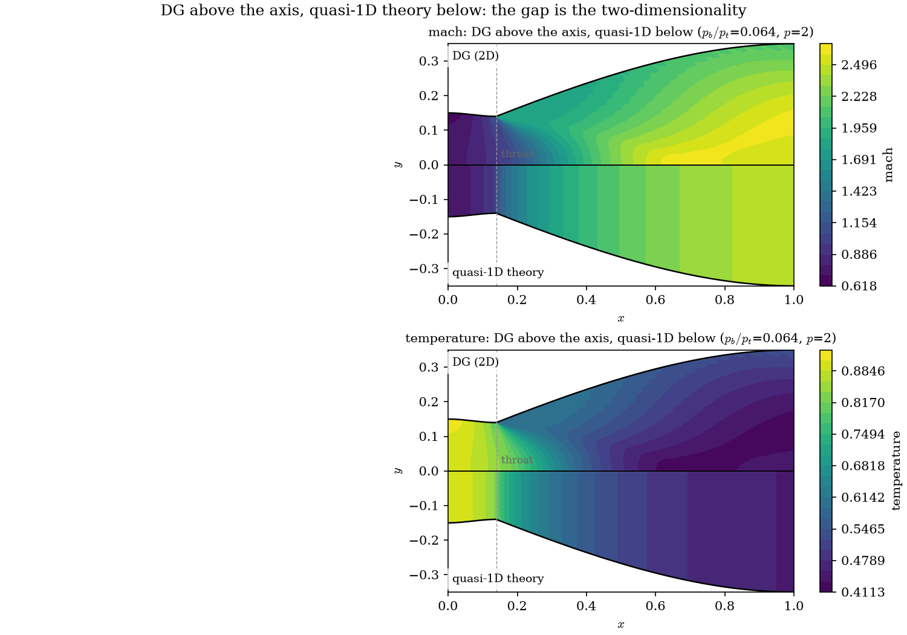

# Using the solver

Everything about *driving* the code: the launcher, the Python API, the
design variables you can change, and how to choose a resolution.
For what it computes, see [`theory.md`](theory.md); for exercises, see
[`lab_guide.md`](lab_guide.md).

---

## The launcher

`./dg2d.sh help` lists everything. Arguments are `name=value`, using the same
names as the Python API, so there is one vocabulary to learn rather than two.

| Command | What it does |
|---|---|
| `./dg2d.sh check` | report the Python, the version, and which backends work |
| `./dg2d.sh list` | list the cases `run` can execute and the decks `@` expands |
| `./dg2d.sh run <case>` | run one of the scripts in [`examples/`](../examples/) |
| `./dg2d.sh solve ...` | one operating point |
| `./dg2d.sh sweep <var> <lo> <hi> <n> ...` | sweep one design variable |
| `./dg2d.sh geometry ...` | inspect a contour; no flow solve |
| `./dg2d.sh bench ...` | time the backends against each other |
| `./dg2d.sh test` | run the test suite |
| `./dg2d.sh install` | `pip install -e ".[all]"`, if you want it installed |
| `./dg2d.sh docs` | where the documentation is |

```bash
./dg2d.sh solve ar=3.0 pb=0.12 p=1 figure=result.png
./dg2d.sh sweep area_ratio 2.0 4.0 9 order=1 csv=sweep.csv
./dg2d.sh geometry contour=bezier bezier_w1=0.7 figure=wall.png
./dg2d.sh bench p=1 refine=1
```

Short aliases: `p`=`order`, `Q`=`geometry_order`, `ref`=`refine`,
`ar`=`area_ratio`, `pb`=`back_pressure_ratio`, `tvb`=`tvb_constant`. Ordinary
`--flags` pass through untouched, so anything `python -m src --help`
documents still works. `M` is deliberately **not** an alias — in this code `M`
always means Mach number, and the TVB constant is not a Mach number.

`geometry` runs no flow solve — use it to check a contour before committing to
a simulation.

**Interface flux.** Two are available, and the choice is a real one:

| `flux=` | What it is | Use it when |
|---|---|---|
| `roe` (default) | Roe's approximate Riemann solver with the Harten–Hyman entropy fix | **Accuracy.** Consistently the lowest entropy error, and what every number in the documentation was produced with |
| `hllc` | HLLC with Batten's wave speeds | **Robustness.** Provably positivity-preserving, needs no entropy fix and so has no constant to tune, and is cheaper |

Measured at the design point: HLLC converges in 451 iterations against Roe's 751
at `p=0` and agrees to ~1% in thrust, while Roe is the more accurate of the two
(entropy error 3.8e-3 against 6.2e-3 at `p=1`). Neither fixes the `p>=1` shocked
divergence. See
[`theory.md`](theory.md#hllc-and-why-it-is-the-robust-choice).

Both run on the Numba fast path.

### The cases

| `run` | Script | Shows | Needs | Roughly |
|---|---|---|---|---|
| `solve` | `01_solve.py` | one design point against quasi-1D theory | — | 5 s |
| **`sweep`** | `02_sweep.py` | **sweeping the area ratio; the thrust optimum** | — | 1 min |
| **`sensitivity`** | `03_sensitivity.py` | **adjoint gradients, verified against finite differences** | JAX | 2 min |
| **`optimise`** | `04_optimise.py` | **L-BFGS-B on a Bézier wall** | JAX, SciPy | 5 min |
| `convergence` | `05_convergence.py` | observed order of accuracy | — | 5 min |
| `shock` | `06_shock.py` | all four operating regimes | — | 5 min |

They are meant to be copied and edited: changing the geometry in one of them is
the normal way to start a study.

### Case files you pass as an argument

A case you run often does not have to live in your shell history. A `@name`
argument is replaced by the lines of [`cases/name.dg`](../cases/), so:

```bash
./dg2d.sh solve @design              # exactly the lines in cases/design.dg
./dg2d.sh solve @design pb=0.12      # the same deck, with one value changed
./dg2d.sh sweep back_pressure_ratio 0.05 0.3 12 @design
./dg2d.sh bench @converged
```

A deck is the same `name=value` lines you would have typed — there is no second
vocabulary and no schema to keep in step with the code:

```
# the design point: shock-free, fully expanded, the case to start from
ar=2.5
pb=0.064
p=1
Q=2
ref=0
```

`#` starts a comment, blank lines are ignored, and **a deck may name another
deck** to build on it, which is all `cases/overexpanded.dg` is:

```
# over-expanded: the exit plane sits below ambient, still shock-free
@design
pb=0.15
```

**Later arguments win.** That is what makes `@design pb=0.12` an override rather
than a conflict, and it is a property of the underlying parser rather than
something the launcher arranges, so it holds for every key.

| Deck | What it is |
|---|---|
| `@design` | the design point: shock-free, fully expanded |
| `@overexpanded` | exit plane below ambient, still shock-free |
| `@converged` | the design point at `p=2`, `refine=1` — quote numbers from this |
| `@shocked` | a shock in the diverging section, at `p=0` because `p>=1` diverges |
| `@contour` | geometry only, for `geometry` |

Because this is argument expansion and nothing more, a deck works with any
subcommand that accepts the keys it holds: `solve`, `sweep` and `bench` take the
full set, while `geometry` takes only the geometry keys and will say
`unrecognized arguments` if handed a deck carrying solver options — which is
also what a typo gets, rather than being silently ignored.

Decks cover one operating point on one mesh. For a sweep with a loop in it, a
sensitivity study or an optimisation, write a Python case file instead — that is
what [`examples/`](../examples/) is, and the names are the same either way, so
nothing has to be unlearned when you outgrow a deck.

---


## Run it from Python

Everything goes through one function. Give it the design you want; leave the
rest alone.

**Save this as `mydesign.py`**, anywhere you like:

```python
#!/usr/bin/env python3
"""My first nozzle: one design point, solved and reported."""

from src import performance, solve_nozzle

result = solve_nozzle(
    contour="smooth",  # wall family
    area_ratio=2.5,  # exit / throat
    throat_x=0.14,  # throat location, fraction of length
    back_pressure_ratio=0.15,  # p_back / p_total — sets the operating point
    order=1,  # polynomial order p
    refine=0,  # mesh refinement level
    verbose=False,  # let this script do the talking
)

assert result.converged, result.message
print(result.summary())
print()
print(performance(result).summary())
```

**Then run it:**

```bash
./dg2d.sh run mydesign.py
```

`run` takes a path as happily as it takes a case name, and it puts the package
on the import path for you — so this works from any directory and with nothing
installed. If you would rather invoke Python yourself, that works too, from the
repository root or after `./dg2d.sh install`:

```bash
python mydesign.py
```

**And you should see:**

```
converged in 951 iterations (0.16 s, numba): residual 6.408e-07 scaled
  (1.25e-06 of initial); min rho 3.0174e-01, min p 5.1730e-02

thrust        0.045825  (c_F = 0.163784, 90.09% of ideal)
  wall form   0.045344  (imbalance 1.05e-02)
mass flow     in 0.301380, out 0.301775  (imbalance 1.31e-03)
exit          M = 2.4490, p/p_t = 0.06661
entropy error 3.7307e-03
```

Read it as: the march reached a steady state in 951 iterations; thrust is
0.0458 and the nozzle is at 90% of its ideal, the two independent thrust
integrals disagree by 1% (that gap is your discretisation error, and it falls
when you raise `refine`); mass in and out agree to 0.1%; the exit is at Mach
2.45.

**The `assert` is not decoration.** A solver that has not converged still hands
you numbers, and they will be wrong. `result.message` then says what went wrong
and what to do about it — so make that assertion the first line of every script
you write.

> **On convergence.** The residual is measured against the problem's own
> physical scale `ρ_t a_t / L`, not against the first iteration's residual. A
> relative criterion would demand a tighter absolute residual the better your
> initial guess is — making a good starting field look *slower* than a bad one,
> and making two runs started differently incomparable.

### Next: change something

The point of the file is that you now edit it. Raise `area_ratio` to 3.5 and
rerun; the exit Mach number climbs and the thrust coefficient does not, because
past the matched condition the nozzle over-expands. That trade is Exercise 1 of
[the lab guide](lab_guide.md), and [the three
workflows](workflows.md#what-students-do-with-it) below are the same file grown into a
sweep, a gradient and an optimisation.

### Units: the solver is non-dimensional

**Nothing in this code is in SI.** There are no metres, kelvin or newtons
anywhere in the solve, and no unit conversion is applied on the way out. The
equations are solved in a non-dimensional form fixed by four choices:

| Reference | Symbol | Value | Set by |
|---|---|---|---|
| Reservoir pressure | $p_t$ | `1` | `total_pressure` |
| Reservoir temperature | $T_t$ | `1` | `total_temperature` |
| Gas constant | $R$ | `0.4` | `Rgas`, chosen as $\gamma - 1$ |
| Length | $L$ | `1` | **every length together** — see below |

> **`length` is not the length scale.** It sets the axial extent while
> `throat_half_height` and `inlet_half_height` set the transverse one, so
> changing `length` alone makes the nozzle more *slender* — a different shape,
> entitled to a different answer. Changing all three together is the rescale,
> and that is exactly invariant.

Everything else follows, and these two are worth knowing because they are
**not** 1:

```math
\rho_t = \frac{p_t}{R T_t} = 2.5, \qquad
a_t = \sqrt{\gamma R T_t} = 0.7483
```

Taking $R = \gamma - 1$ is the choice that makes the rest tidy: static
temperature is then numerically equal to the specific internal energy,
$T = p/(\rho R) = e$.

**Read every output as a ratio.** The reported quantities are already
non-dimensional, or are reported alongside a non-dimensional form:

| Output | Non-dimensionalised by | Note |
|---|---|---|
| `thrust_coefficient` | $p_t A^{*}$ | the headline number |
| `discharge_coefficient` | $\rho_t a_t A^{*}$ | choked flow fixes this at 0.5787 for $\gamma=1.4$ |
| `exit_pressure_ratio` | $p_t$ | |
| `exit_temperature_ratio` | $T_t$ | |
| `specific_thrust_ratio` | $a_t$ | effective exhaust velocity as a Mach number |
| `thrust_efficiency`, `entropy_error` | — | already dimensionless |
| `exit_mach_area_averaged` | — | already dimensionless |
| `thrust`, `mass_flow_in/out`, `specific_thrust` | — | **carry the scales above**: $p_t L$, $\rho_t a_t L$ and $a_t$ respectively |

So `thrust = 0.049868` is a force per unit depth in units of $p_t L$; to compare
two nozzles, use `thrust_coefficient` instead. `C_d` is the better mass-flow
number for the same reason — once the throat is sonic it depends on $\gamma$
alone, so it is the same for every choked run regardless of reservoir and
throat size. Measured 0.5756 against the closed form

```math
\frac{\dot m}{\rho_t a_t A^{*}}
  = \left(\frac{2}{\gamma+1}\right)^{\frac{\gamma+1}{2(\gamma-1)}} = 0.5787
```

a 0.5% gap that is discretisation error, and is pinned by a test.

### Is it actually non-dimensional? Measured, not asserted

Invariance is the property being claimed, so it is tested rather than stated.
`tests/test_nondimensional.py` rescales the references and compares converged
solves:

| Rescaling | Dimensionless outputs | Dimensional outputs | Iterations |
|---|---|---|---|
| every length $\times 2$, $\times 5$, $\times \tfrac14$ | **exactly 0 drift** | scale by the factor to 1e-10 | identical |
| $p_t \times 10$ | exact, 1e-16 | scale by 10 | identical |
| $T_t \times 4$ | 8e-16 — round-off | — | identical |
| $R \times 2.5$ | 3e-14 — round-off | — | identical |

All four are exact, and the iteration counts match. The last two were not always
so, and the reason is worth keeping, because it is the kind of error a
non-dimensionalisation invites.

**The convergence criterion used to be mixed-dimension.** The conserved
variables scale as $\rho_t$, $\rho_t a_t$ and $\rho_t a_t^2$ — three different
powers of $a_t$ — but the residual was a single RMS norm over all four
components, divided by the single scale $\rho_t a_t / L$. No one scale can
non-dimensionalise a mixed-dimension norm, so changing $a_t$ (via $T_t$ or $R$)
reweighted the components against each other and the march crossed the
tolerance in a different place: ~7e-11 of drift at `tolerance=1e-10`, and 50
iterations' difference.

The solution it converged to never moved — the field at a fixed iteration was
invariant to the last bit — so this only ever changed *where the march stopped*.
It is fixed regardless: each component is divided by its own power of $a_t$
before the sum, so every term is dimensionless against the same reference. See
`component_weights` in `src/backends/base.py`.

Scaling $p_t$ was immune to this all along, because it multiplies all four
components by the *same* factor.

**To put results in physical units**, multiply by your own reference values:
thrust by $p_t L$ (times the depth), mass flow by $\rho_t a_t L$, and so on.
Nothing in the solver needs to change — the non-dimensional solution is the
same for every reservoir condition at a given $\gamma$ and back-pressure ratio,
which is exactly why it is solved this way.

### Plotting

```python
import matplotlib.pyplot as plt

from src.plotting import overview, plot_centreline, plot_field

overview(result)  # four-panel summary; its top panel is the Mach contour
plt.show()
```

**Contours of any derived scalar.** `plot_field` fills contours over the
nozzle, mirrored about the axis so you see the physical channel rather than the
meshed half. Mach is the default because it is the field you read a nozzle by:

```python
plot_field(result, "mach")  # the default
plot_field(result, "temperature")
plot_field(result, "pressure")
```

| `name=` | Quantity |
|---|---|
| `mach` *(default)* | Mach number |
| `pressure` | static pressure |
| `density` | density |
| `temperature` | static temperature, `p/(R rho)` |
| `vx`, `vy`, `velocity` | axial, transverse and total speed |
| `entropy` | `(p/rho^gamma)` over its reservoir value |

Each element is subdivided `subdivisions` times per edge, so the variation
*inside* an element is drawn — plotting only the vertices would throw away most
of what `p = 2` buys.

**Axial profiles against quasi-1D theory.** `plot_centreline` draws the DG
solution along the symmetry axis with the quasi-1D prediction over it. The gap
between the two curves *is* the two-dimensionality of the flow:

```python
plot_centreline(result)  # Mach number, the default
plot_centreline(result, quantity="temperature")
```

`quantity` is one of `mach`, `pressure`, `density`, `temperature`, `vx` or
`velocity`; anything else is refused by name rather than failing inside
Matplotlib.

**The 2D solution and quasi-1D theory in one picture**, inside the nozzle.
`plot_dg_vs_quasi1d` puts
the DG field above the axis and the quasi-1D prediction for the same geometry
below it, on one shared colour scale:

```python
from src.plotting import plot_dg_vs_quasi1d

plot_dg_vs_quasi1d(result, "mach")
plot_dg_vs_quasi1d(result, "temperature")
```



Because the nozzle is symmetric, the lower half is *where the mirror image of
the DG solution would have gone* — so **contours that fail to meet at the axis
are the two-dimensionality of the flow**, read off at a glance instead of
inferred from two separate plots. Quasi-1D has no transverse coordinate, so its
half is flat in `y` at each station: seeing it flat is seeing the assumption.

The shared colour scale is the point. Giving each half its own would make even
a large disagreement look like agreement. Quantities quasi-1D does not predict
(`vy`, `entropy`) are refused rather than drawn against an implicit zero.

**Line-outs as arrays**, if you would rather have the numbers than a picture —
each returns a dict of `x`, `y` and every scalar above:

```python
from src.postprocess import centreline_profile, exit_profile, wall_profile

cl = centreline_profile(result)
print(cl["temperature"].min(), cl["mach"].max())
```

---


## Design variables

The nozzle is **planar** (a 2D channel of unit depth), so the one-dimensional
area is the channel height and the area ratio is the height ratio —
isentropic tables apply directly.


| Keyword | Meaning | Default |
|---|---|---|
| `contour` | wall family, see below | `'bell'` |
| `area_ratio` | exit-to-throat area ratio; sets the design Mach number | `2.5019` |
| `throat_x` | throat location as a fraction of length | `0.1388` |
| `throat_half_height` | throat half-height; scales the whole nozzle | `0.13989434` |
| `inlet_half_height` | inlet half-height | `0.15` |
| `length` | axial length | `1.0` |
| `theta_initial_deg` | wall angle just past the throat | auto (monotone) |
| `theta_exit_deg` | wall angle at the exit plane | `0.0` |
| `bezier_w1`, `bezier_w2` | Bézier shape weights | `0.55`, `0.90` |
| `back_pressure_ratio` | `p_back / p_total`; sets the operating point | `0.15` |

The three lengths carry **no units** — see
[units](#units-the-solver-is-non-dimensional). Only their ratios enter the
solution, which is why multiplying all three by the same factor leaves every
dimensionless output bit-identical and is pinned by a test. Scaling `length`
*alone* is not a rescale: it holds the heights fixed and so makes the nozzle
more slender, which is a different shape entitled to a different answer.

### Contour families

| `contour` | Shape | Use it for |
|---|---|---|
| `'bell'` | cubic Hermite with prescribed wall angles | the general-purpose design family |
| `'smooth'` | `'bell'` with a zero throat angle, so the wall is C¹ | **convergence studies** |
| `'conical'` | straight diverging wall | the simplest baseline |
| `'moc'` | `'bell'` at the classical Rao angles (30°, 0°) | textbook comparison |
| `'bezier'` | cubic Bézier, two shape weights | **shape optimisation** |
| `'analytic'` | a fixed closed-form contour, smooth throughout | a verification geometry with no throat corner |

> **A deliberate corner.** With `theta_initial_deg > 0` the wall slope jumps at
> the throat. That sharp-corner expansion is the classical minimum-length
> idealisation, not a mistake — but it puts a Prandtl–Meyer singularity in the
> exact solution, which **caps the achievable order of accuracy**. A convergence
> study must use `'smooth'` or `'analytic'`. See
> [Verification](verification.md#verification).

### Operating point

`back_pressure_ratio` is what makes the nozzle interesting. Three critical
values divide the map — ask for them before you run anything:

```python
from src import critical_ratios

print(critical_ratios(2.5019).describe())
# first=0.9609 (choking), second=0.4345 (shock at exit), third=0.0639 (design, M_exit=2.444)
```

| `back_pressure_ratio` | Regime |
|---|---|
| above `first` | not choked; subsonic throughout |
| between `second` and `first` | **choked, normal shock in the diverging section** |
| between `third` and `second` | shock-free, over-expanded |
| at `third` | design point, perfectly expanded |
| below `third` | under-expanded |

**Shocked cases (between the second and first critical ratios) mostly do not converge** — `p=0` sometimes does, `p>=1` diverges; see [Known limitation](performance.md#known-limitation-shocked-operating-points).

---


## Choosing resolution


| Knob | Meaning |
|---|---|
| `order` (`p`) | solution polynomial order. `0` is finite volume; `1` and `2` are 2nd and 3rd order. |
| `geometry_order` (`Q`) | `1` straight-sided, `2` curved. `Q=2` represents the curved wall ~125× more accurately at the same element count. |
| `refine` | uniform refinement; each level multiplies elements by 4. |
| `element` | `'tri'` (default) or `'quad'`. |
| `cfl` | Courant number, `cfl/(2p+1)` times the geometric step. The default is order-dependent — see [the time step](performance.md#the-time-step). |

Solve times on 4 cores of a 2.1 GHz Xeon, default `bell` contour, converged to
`1e-6` on the scaled residual, with the Numba kernels already compiled:

| `p` | `refine` | elements | DOF | iterations | time | ms/iteration |
|---|---|---|---|---|---|---|
| 0 | 0 | 140 | 140 | 751 | **0.08 s** | 0.11 |
| 1 | 0 | 140 | 420 | 951 | **0.16 s** | 0.17 |
| 2 | 0 | 140 | 840 | 1901 | **0.46 s** | 0.24 |
| 1 | 1 | 560 | 1680 | 1401 | **0.43 s** | 0.31 |
| 2 | 1 | 560 | 3360 | 3601 | **2.3 s** | 0.64 |
| 1 | 2 | 2240 | 6720 | 3301 | **2.9 s** | 0.86 |

That is 2.5–3.8× faster than this table read a release ago; [what changed and
what each part was worth](performance.md#what-made-it-faster) is below.

The *first* solve in a session pays a few seconds of Numba compilation on top,
once, and then caches it.

**Start with `p=1, refine=0`** for design exploration — a fifth of a second, and
already within a few percent on thrust. Move to `p=2, geometry_order=2,
refine=1` for numbers you will put in a report.

---
