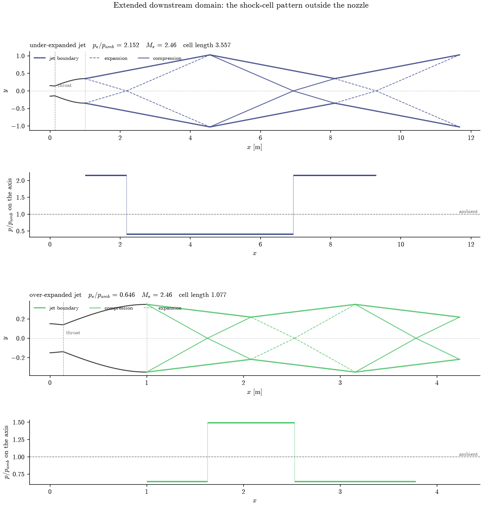
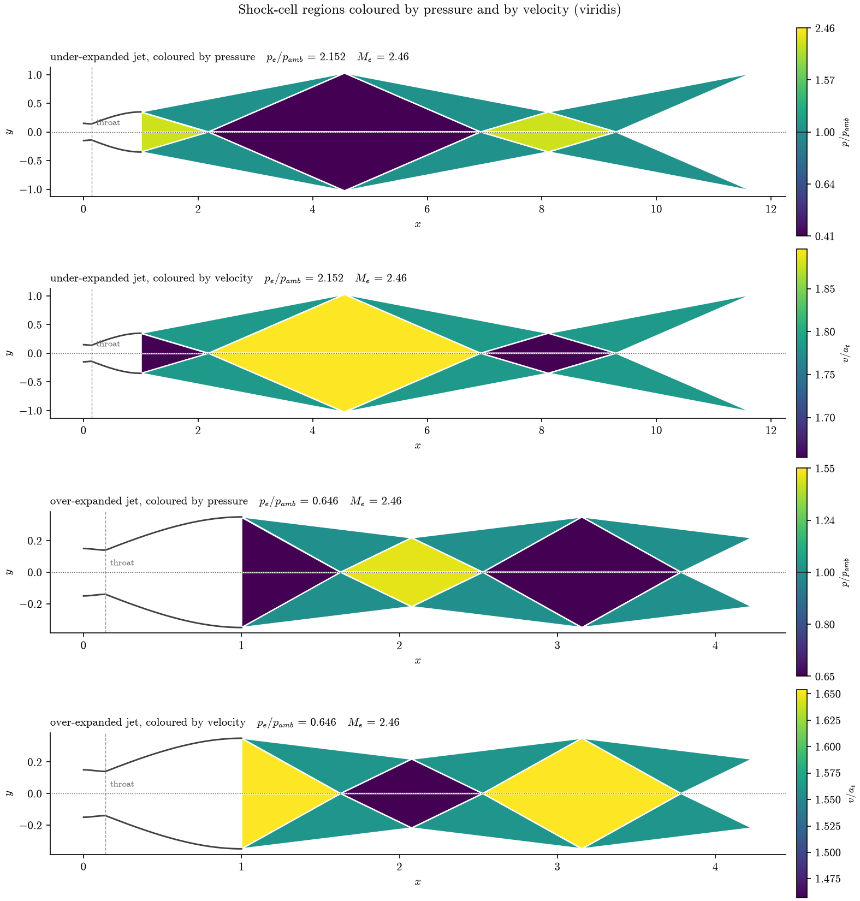

# Workflows

The four things this code was built for, each with a runnable case in
[`../examples/`](../examples/).

---

## What students do with it

Three workflows, each with a worked case you can run right now and then edit.

### 1. Parameter sweeps

```bash
./dg2d.sh run sweep          # examples/02_sweep.py
```

Or from the command line, with no script at all:

```bash
./dg2d.sh sweep area_ratio 2.0 4.0 9 order=1 contour=smooth csv=sweep.csv
```

In Python:

```python
import numpy as np
from src import sweep

table = sweep(
    area_ratio=np.linspace(2.0, 4.0, 9),  # iterable  -> a sweep axis
    order=1,
    contour="smooth",  # scalar    -> a fixed setting
)
print(table.table())
table.to_csv("sweep.csv")
```


Thrust **peaks and then falls** — past the matched condition the nozzle
over-expands and the extra area costs more than the extra exit Mach number buys.
On this sweep the optimum is at `area_ratio = 3.25` (`c_F = 0.176`), and thrust
efficiency drops from 0.956 to 0.869 across the range. That trade is the point of
Exercise 1 in the lab guide.

Sweeps **warm start** from the previous point automatically. Measured on a
7-point area-ratio sweep that is 40% fewer iterations and 1.8× less wall time.
Two parameters give a full grid:

```python
grid = sweep(
    area_ratio=np.linspace(2.0, 4.0, 7),
    back_pressure_ratio=np.linspace(0.08, 0.40, 6),
    order=1,
)
from src.plotting import plot_sweep

plot_sweep(grid, "thrust_coefficient")  # 2D contour map
```

Every point records 19 metrics (`src.METRICS`), including the quasi-1D
reference values so you can see where two-dimensionality starts to matter.
Points that fail are recorded, not hidden:

```python
for point, why in table.failures():
    print(point, "→", why)
```

### 2. Sensitivity analysis

```bash
./dg2d.sh run sensitivity    # examples/03_sensitivity.py
```

Exact derivatives by the **discrete adjoint** — one solve, any number of design
variables:

```python
from src import differentiable_case

dc = differentiable_case(order=1, contour="bezier", back_pressure_ratio=0.15)

value, grad, _ = dc.value_and_gradient(
    "thrust",
    names=("area_ratio", "throat_x", "bezier_w1", "bezier_w2", "theta_exit"),
)
print(value, grad)
```

Verify it against finite differences — and make your students do this once:

```python
from src import check_gradient

check_gradient(dc, "thrust", names=("area_ratio", "throat_x"))
```

```
objective thrust = 0.0458513361
parameter                     adjoint    finite diff    rel err
area_ratio               9.772082e-03   9.772082e-03   2.12e-08
throat_x                -1.490300e-02  -1.490297e-02   2.01e-06
```

Objectives: `thrust`, `thrust_coefficient`, `exit_mach`, `mass_flow`,
`exit_pressure`. Design variables: every geometric one, plus `back_pressure`.

> The gradient is of the **discrete** problem, which is what optimisation needs.
> Use a shock-free operating point: a limiter switching on and off introduces
> kinks, and a shock's position is only piecewise differentiable.

### 3. Shape optimisation

```bash
./dg2d.sh run optimise       # examples/04_optimise.py
```

The gradient plugs straight into SciPy:

```python
import numpy as np
from scipy.optimize import minimize
from src import differentiable_case

dc = differentiable_case(order=1, contour="bezier")
names = ("area_ratio", "bezier_w1", "bezier_w2")


def negative_thrust(x):
    params = dict(zip(names, x))
    value, grad, _ = dc.value_and_gradient("thrust", params, names=names)
    return -value, -np.array([grad[n] for n in names])


x0 = np.array([dc.default_params()[n] for n in names])
best = minimize(
    negative_thrust, x0, jac=True, method="L-BFGS-B", bounds=[(1.5, 5.0), (0.0, 1.0), (0.0, 1.0)]
)
```

All three live in [`examples/`](../examples/), alongside a first solve, a
convergence study and a back-pressure sweep. `./dg2d.sh list` names them.

### 4. What happens outside the nozzle

The mesh stops at the lip, but the interesting waves do not. A nozzle designed to
be shock free inside puts its whole wave system *outside*, and
[`src/external/`](../src/external/) evaluates that in closed form from the converged
exit state. It is deliberately separate from the solver: nothing in a flow solve
calls it, so post-processing that can legitimately have no answer fails where you
asked for it rather than inside a march.

```bash
./dg2d.sh run external       # examples/07_external.py
```

```python
from src.api import solve_nozzle
from src.external import exit_wave_structure, jet_wave_cells, plot_jet_cells

r = solve_nozzle(order=2, refine=0, back_pressure_ratio=0.0640)

print(exit_wave_structure(r, ambient_pressure_ratio=0.03).describe())
# under-expanded: p_e/p_amb = 2.1517, M_e = 2.458 -> 2.957,
# Prandtl-Meyer fan from 24.01 to 8.98 deg, turning the flow 10.79 deg outward

cells = jet_wave_cells(r, ambient_pressure_ratio=0.03, cells=3)
print(cells.describe())
# under-expanded jet: 6 waves, cell length 3.5574 (10.16 exit half-heights),
# reaching x = 11.6723 ...

plot_jet_cells(r, cells)
```

`exit_wave_structure` gives the first wave at the lip. `jet_wave_cells` extends
the domain downstream, marching that wave through its reflections off the
symmetry axis and the constant-pressure jet boundary to give the repeating
shock-cell pattern — the "shock diamonds" of a rocket plume. The domain reaches
roughly ten nozzle lengths at a strong under-expansion, and the cell length is a
real number you can compare against a photograph.



`plot_jet_field` colours the regions instead of drawing the waves, which is what
makes the ringing read as alternating states rather than as a line drawing. The
two quantities are encoded differently on purpose: pressure is a *polarity* —
which side of ambient a region sits on — so it gets a diverging ramp pinned at
`p_amb`, on `log(p/p_amb)` so that twice ambient and half ambient are equal and
opposite departures. Velocity is a magnitude with no special middle value, so it
gets a single-hue sequential ramp.



Two things to know before reading numbers off it. **Every wave is treated as
isentropic**, which is what makes the pattern exactly periodic; a real jet's
compressions steepen into shocks, lose total pressure, and the cells decay
downstream. And a strongly mismatched jet forms a **Mach disc** rather than the
regular reflection assumed here — the march detects that and stops rather than
drawing a pattern that does not exist.

---
